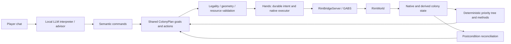

# RimBot architecture

RimBot uses deterministic systems for routine colony operation and a local LLM
for interactive player commands and strategic advice. Both paths share durable
ColonyPlan goals/actions, validation, resource reservations and Hands. RimWorld
owns simulation and legality; the LLM may request actions but does not own colony
invariants. RimBridgeServer/GABS is the sole runtime backend.

## Runtime and ownership

| Piece | Responsibility and source |
| --- | --- |
| Entry and lifecycle | `launch.ps1` prepares/reuses the isolated game and controller; `controller/rimbot/__main__.py` starts FastAPI/Uvicorn on loopback port 8787. `headless.py` prepares separate test profiles. |
| Runtime | `bridge_runtime.py` coordinates observation, reviews, execution, player direction, identity, clock events and rendering. Async guards prevent stale work after direction, plan or load changes. |
| Native boundary | `bridge.py` uses the MCP SDK to launch GABS and discover/call installed tools. `bridge_game.py` restricts gameplay capabilities; `native_contracts.py` validates native arguments and receipts. |
| Game integration | `integrations/colony-bridge/src` supplies colony/status, pawn, item, building, room, zone, cell, research and world reads; construction, installation, settings, bills, orders, trade and dialog actions; clock supervision and rendering demand. The separate identity assembly persists colony identity in saves. RimBridgeServer supplies general game/UI tools. |
| Observation | `bridge_observation.py` preserves raw responses and projects the generated `bridge_models.py` DTO. `data/bridge_observation.schema.json` is its source; `scripts/generate_bridge_observation.py` checks generation drift. |
| Control | `colony_controller.py` evaluates the priority tree in `colony_policy.py` and decomposes goals with `colony_skills.py`. `player_commands.py` validates semantic chat requests; `planner.py` interprets only new human messages. `colony_plan.py` separates goals/specifications from execution progress. `resource_accounting.py` arbitrates both paths. |
| Execution | `hands.py` compiles semantic steps, validates geometry, records intent and advances native orders. `construction_grounding.py` and `construction_preflight.py` ground definitions and preview placement. `projects.py`, `medical_outcome.py` and `trading.py` reconcile specific outcomes. |
| Inference and advice | `model.py`, `request_budget.py` and `model_router.py` handle local streaming requests, structured-response recovery, context budgets and optional roles. `consultation.py`, `scout.py` and `visual_review.py` supply bounded advice. |
| Knowledge and persistence | `knowledge.py` retrieves local strategy cards; `wiki.py` retrieves reference material. `memory.py` stores advisory colony notes. `review_evidence.py` retains exact review-local results. `store.py` stores state, events and bounded compressed decision checkpoints in SQLite. |
| Dashboard and diagnostics | `bridge_server.py` serves the Vite-built dashboard and state, chat, control, project, notebook, camera and diagnostic endpoints. `dashboard/src/features/manager` renders colony/people, plans, activity and notes. `tool_diagnostics.py` records strategy/native call outcomes. |

Paths in the table without a directory prefix are under `controller/rimbot/`.

## Observe, decide, execute, verify

1. Pause and read native state. Sequential observations are not an atomic
   snapshot. `home/colony_facts` reports accessible shared-diet nutrition and fed
   consumption, viable crop cells, indoor sleeping, temperatures, cooking, safe
   nearby wild-plant access, starter terrain/support affordances and actual definition costs. Native
   growers retain ownership of cultivated crop harvest timing. Unknown
   observations never certify recovery.
2. Only a new human chat revision invokes `planner.py`. Mode changes and routine
   native events do not invoke inference. Model failure is reported to the player
   while deterministic operation can continue.
3. The priority tree evaluates combat, critical medicine, food, shelter,
   temperature, cooking, work coverage, power, storage, defense and wood. Food,
   wood and temperature use separate entry/recovery thresholds. Emergencies
   suspend lower priority routine goals. Methods, blockers, provenance and
   progress evidence live in the existing SQLite-backed ColonyPlan.
4. Methods compile small batches of semantic construction/zone/native actions.
   Starter templates rank nearby legal shelter sites and disjoint fertile farm
   patches, then use bounded native previews. Fragmented soil can use smaller
   patches within the same zone budget; insufficient farmland does not reject an
   otherwise legal shelter. Selected field capacity remains separate from observed
   growing cells and the production gate. Work allocation uses observed
   capabilities/skills, job load and stable identity tie breaks; it respects the
   game's checkbox versus manual-priority modes and explicit player overrides.
5. Both entry paths commit through revision/context guards, geometry/native
   preflight and shared resource accounting. Unissued slots reserve native costs;
   issued blueprints use native deficits instead of a second reservation.
   Admission reserves all accepted projects. Dispatch budgets in stable ready
   priority order, allowing affordable earlier work to proceed after stock is
   consumed. Later and dependency-gated projects yield; the selected remaining
   batch, earlier ready work, player reserves and uncertain writes stay protected.
   Dispatch rechecks current stock and player resource policies. Changed or
   unknown costs require validation. Production bills under protected-resource
   policies currently block until ingredient accounting is available.
6. New growing zones validate crop identity and pollution compatibility before
   registration, and configure the crop in the same native operation.
   Hands records intent before writes, retains partial progress and verifies
   native outcomes. Routine execution yields after 12 operations. An explicit
   current player request may dispatch through the same Hands in Manual, while
   the clock stays paused; it does not dispatch unrelated autonomous work.

`FOOTHOLD_STABLE` requires every gate: sufficient sleeping capacity in a roofed
indoor room, at least three stock days of food by default, viable growing cells,
indoor food storage, usable cooking with a bill, safe sleeping temperature,
sufficient power if electrical thermal loads exist, no critical patient, two
armed colonists (or everyone in a smaller colony), no active threat, and verified
work assignments. Accepted blueprints cannot satisfy these gates. Stability is
reversible when observations change. The food forecast apportions shared nutrition
by native demand and credits held food only to its observed holder. Earliest-expiry
allocation uses native rot deadlines at the current temperature; the lowest
per-colonist runway drives the food gate. Invalid supply observations remain unknown.
Future harvest, changing temperatures, job selection and food sharing are not
guaranteed. Harvest ETA remains an optimistic lower bound.

Goals record selected methods, attempts, step IDs and observable progress.
Invalid templates have a bounded alternative-site search; unknown or failed
native actions become explicit blockers. A no-progress watchdog prevents silent
indefinite waiting. Above eight colonists, starter sleeping uses verified room and
native footprint fitting, preserving its entrance aisle and three service rows.
The fixed shell can still exhaust capacity and then requires explicit expansion;
controller fitting checks do not establish larger-colony gameplay acceptance.
Watchdog holds retain their tick, reason and completed action identities. A newly
observed completion of tracked work can release that exact hold and continue the
existing goal without replacing methods or receipts. Unchanged state, rewinds,
cancelled or failed actions, different blockers and Manual retain the hold;
emergencies still suspend lower-priority work.
The initial faction/settlement naming prompt is a maintained bootstrap goal.
Its semantic native action validates the exact observed generated suggestions,
uses the native naming callbacks and verifies the names and dialog closure.
Other forced dialogs retain the normal hold behavior.

Autonomous hunting screens current wild-animal observations before compiling a
designation. Harmless, undesignated prey must be within 50 cells of the colony
anchor and more than 25 cells from live wild predators, using square-grid distance.
Unknown predator flags or positions prevent selection. The food goal retains
candidate IDs and predator rejection evidence. Compiled hunting methods retain
the exact prey identity, anchor and action signature. Immediately before writing,
the shared runtime rechecks wildlife, the planned cell, outstanding hunt count and
paused native tick under its writer lock. It then verifies the selected animal's
hunt designation. Missing legacy target metadata and changed observations block
without a write; unconfirmed writes remain uncertain. This does not certify a
hunter's route or monitor threats after designation. Native external inputs are
not atomic with these Python checks.

Wild-plant acquisition limits new orders by the remaining per-colonist nutrition
target and already designated native harvest yield. Pending yield limits duplicate
acquisition but never counts as stored food or clears food risk. Individual plants
are indivisible, so a batch can exceed its remaining target by one plant's yield.

A bounded combat method prepares two capable colonists for one small manhunting
animal or confirmed small predator hunting colony members, then uses native attacks, threat readback, treatment and owned-draft
cleanup. Its clock acknowledges only that inspected target after orders dispatch;
other threats and severe injury remain guarded. Blocked emergencies prevent
routine waiting work from restarting time. Larger threats and electrical
generation still report explicit blockers.

## Interactive commands and shared intent

The chat command union supports SetResearch, BuildRoom, PlaceBuildings, CreateZone,
SetWorkPriority, CreateBill, DraftPawn, MovePawn, CreateGoal, CancelGoal and
ModifyResourcePolicy and SetResourceReserve. The model receives individually named semantic tools and read-only native
inspection/preview tools, not arbitrary native execution. Fresh native facts and
resource-definition labels are available in Manual as well as Automate. The
latest player message follows the evidence context. Consecutive maintained goal
and policy requests in the same response are applied before interpretation ends;
downstream routine work stays with the controller. Partial rejections are included
in the acknowledgment alongside accepted requests.
Acknowledgments come from accepted structured results, not inferred completion. Optional local
knowledge/wiki lookup, colony notebook, scout, visual review and consultations
remain chat tools. Advice is evidence, never executable authority.

Research admission resolves the player's project label through native dry-run
validation before adding an action. Refusals return the native reason directly;
successful requests use the resolved definition and still pass through Hands and
fresh research readback. Research contract discovery permits reads/previews only.
Work commands accept an exact unambiguous colonist name or observed ID, then retain
the native ID for execution and persistent work overrides. Current pawn jobs do
not establish work-type assignments.

Initial chat context includes the shared controller state and a native fact-section
index. Large native definition catalogs are retrieved through `inspect_colony_facts`
in one to three sections instead of being inlined into every question. These reads
are explicitly historical observations from the current review; native validation
still refreshes facts before a command is accepted.
The initial context retains a bounded native resource-label glossary so resource
policy names remain grounded when the larger definition catalog is omitted.
Resource choices expose exact native display labels, with definition IDs used for
ambiguous labels. Exact observed IDs from earlier context remain valid aliases.
Resolution persists the native definition ID; base names do not include qualified
resource variants automatically.

Actions carry PLAYER, AUTOPILOT or LLM_ADVISOR provenance. Advisory provenance
cannot commit orders. Player steps normally run before routine optimization;
hard validation and resource policies still apply. A food target updates the
same EnsureFoodSupply goal and hysteresis policy. Work overrides are retained
by the deterministic allocator. Resource constraints include reserves and
normal/defense-only/stopped spending. `ModifyResourcePolicy` changes only spending;
`SetResourceReserve` changes only an explicit numeric reserve, including zero.
Each preserves the other field and validates the resource against native facts.
The spending contract rejects reserve fields; combined requests use separate
policy calls in one interpreter response. Existing stored policies retain their
values. Explicit draft/movement overrides prevent
autonomous recruitment or cleanup from taking ownership of those pawns.

Room and zone commands retain an intent ID and request history. A follow-up can
replace unissued geometry after validating its replacement. Issued geometry
requires an explicit construction change rather than silent relocation. Player
construction has tracked goals; related pending or blocked player work prevents
a competing autonomous project. Cancelling related player work suppresses its
autonomous replacement until an explicit goal request re-enables it. Existing
native blueprints/designations are retained by `CancelGoal`.

Explicit `CancelConstruction` resolves a tracked player construction intent and
captures its current pending native objects from issued placements. Admission
previews every exact target before atomically accepting the removal batch and
suppressing the original source. Shared Hands persists each removal intent and
uses the native cancellation path with colony/load/map, ThingID, definition,
stuff and position checks. Completed buildings remain. An uncertain removal is
observed before any further action: absence satisfies that exact target, while
a still-present target blocks replay. A fresh explicit request can capture the
remaining orders; existing accepted batches never retarget replacements or loads.
Explicit English preservation clauses refuse removal at command admission,
plan admission and execution even if the model selects the removal tool. This
conservative refusal does not certify arbitrary wording or multi-intent scope.

After a player shelter shell completes, sleeping handoff verifies its exact native
interior and roof coverage before furnishing the missing indoor sleeping capacity.
Each spot uses a native accepted footprint wholly inside that room; existing
obstructions and a continuous entrance aisle are excluded. Changed/unknown rooms
or insufficient space block for refinement instead of issuing another shell.
Roof work keeps simulation requested. Storage, cooking and thermal furniture wait
for the chosen player shell and use its verified room geometry. Building footprints
and entrance aisles are excluded; food-zone previews must preserve existing zones.
The native footprint census can contain harmless things: accepted placements are
screened for actual building conflicts, wipes and frame cancellation. Unissued
cached farm patches are recomputed around accepted player shells and walkways;
issued growing zones require explicit refinement instead of silent replacement.
Work allocation batches are identified by the remaining native changes so cohorts
larger than eight continue through subsequent batches.

Chat can inspect structured controller facts, gates, goals, blockers, reservations,
policies and intent history to explain what is running or why work is blocked.
The dashboard presents the same state. Its Autopilot page shows native readings,
all foothold gates, goal provenance/blockers and effective food, wood, temperature
and execution-speed parameters. Player setting edits go through a typed local API,
colony identity and effective-policy version checks, and cross-field validation.
They persist in ColonyPlan, invalidate pending direction and wake deterministic
review without creating a human chat request. Verification/recovery limits remain
read-only in the editor. Chat food targets and the editor use the same policy.
Unsaved drafts survive polling; concurrent changes require an explicit reload. Runtime revision/load guards reject stale
requests and conversational changes. Manual execution is scoped to the accepted
current player requests and does not resume time or release an external hold.

## Action and completion contracts

| Committed action | Completion boundary |
| --- | --- |
| `build_room_shell`, `place_buildings` | Native building observations through ProjectBook; a shell does not certify roofing or usable shelter. |
| `create_zone` | Validated native zone geometry/readback; storage and crop production are separate outcomes. |
| `native_operation` | Schema-validated native receipt/readback by default. Bills, settings, designators and UI actions do not imply downstream pawn labor finished. |
| `home/install` through `native_operation` | Exact inner building identity at the intended destination/rotation. |
| Medical native operations | Optional `patient_tended` and `patient_in_bed` wait for fresh living-patient observations. These certify current treatment/delivery state, not full healing or actor attribution. |
| `trade` | Guarded open/stage/preview/accept with participant, content and silver-budget checks; hauling/storage remain separate. |
| `clock`, `stand_down` | Native clock control or verified release of selected current-load AI-owned drafts; neither certifies combat victory. |

Dependencies distinguish orders issued from work complete. Stable step identities
retain receipts; changed intent requires a new identity. Duplicate intent and
cancelled fingerprints prevent recreating the same work under another ID.
An unchanged cancelled step can remain in subsequent plan revisions with its
receipts intact; it is never ready for execution. Changing or reintroducing that
cancelled work is rejected. Cancelling a plan step does not cancel existing game orders. Observation failures
retain issued work until fresh evidence arrives. Ambiguous non-idempotent writes
block for inspection instead of automatic replay; only explicitly retryable
failures can be retried through the plan.

Shared spatial validation rejects overlapping planned room bounds, growing zones
inside planned rooms, and building footprints across reserved walkways or a room's
doorway and immediate inside/outside approaches. Indoor stockpiles remain allowed.
Changing construction, zones or walkways refreshes native footprints for the live
plan, including retained buildings; unavailable geometry refuses admission.
Hands rechecks the current placement's footprint before writing. These constraints
protect accepted planned space; they do not establish native reachability, arbitrary
room connectivity, future expansion rights or access throughout pawn construction.

New room shells also inspect the complete native zone census, rejecting enclosed
farms even when their cells do not touch the perimeter. Indoor stockpiles remain
allowed; perimeter overlap, unknown zone kinds and incomplete or conflicting zone
geometry block construction. Exact three-cell native reads require walkable,
passable, unfogged approaches immediately inside and outside the doorway. Hands
refreshes these checks for every unissued shell placement, preserving existing
receipts on refusal. These reads do not predict future blueprint obstruction or
prove a route to colonists, and native input is not atomic with Python validation.

Shell admission and each dispatch batch also scan the interior and a three-cell
exterior margin, clipping to observed map bounds and splitting detailed reads into
at most 1024 cells each. Four-neighbor traversal requires usable interior cells to
connect to the inside approach, and the outside approach to reach the edge of that local
margin without crossing the proposed shell or another planned shell's walls.
Unknown interior geometry refuses construction; exterior unknowns cannot establish
a route. Map edges do not count as exits. This is local topology validation, not
native pawn reachability or a forecast of arbitrary future building obstructions.
Changing the planned shells revalidates retained shells too, so expansion cannot
silently seal the only observed local exit of an already completed tracked room.

New zone project targets retain expected patches, kind and crop. Fresh complete
native list/grid geometry must still match before the action can satisfy dependent
work. New building targets also retain expected facing for blueprints, frames and
completed buildings. Native edits invalidate completion; unavailable observations
hold execution and can recover through reads without replay. Legacy targets lacking
these expectations retain their earlier contracts. Facing currently uses native
cardinal labels; unrecognized localized labels remain unavailable.

Completed actions removed from the active specification move to a compressed,
colony-scoped SQLite archive. Their exact specification, progress/receipts and
cost metadata are committed atomically with the compact live snapshot before
in-memory removal. Current combat references remain live until released. The
archive participates in paired database backups and rejects reused identities
after restart; missing archive data blocks admission. `inspect_plan` retrieves
archived records by exact ID. The last twelve plan revisions remain in the live
history; immutable archive storage grows with completed work.
Method-to-action references whose actions are all archived move into a separate
immutable SQLite table in the same snapshot transaction. Goal deduplication checks
both live method entries and that table. Each natural goal reopening advances a
method epoch, allowing new work without deleting archived associations. Pending
methods remain live, and a missing method archive blocks replay after restart.

Recent event reads use colony/sequence indexes, including a partial index for
non-diagnostic history. Index migration preserves every event and its identity;
it does not bound ledger disk growth or discard method deduplication evidence.

Confirmed interrupted autonomous treatment has bounded recovery on the same action
identity. Under the runtime writer lock, fresh patient/doctor observations and the
native tick must match the issued load and current direction. Completed or resumed treatment
is observed without another order. A replacement archives the prior receipt/failure
in durable action recovery history, clears only that attempt's issued slots, and
passes through normal Hands preview, validation and postcondition tracking again.
The existing method-attempt limit bounds replacements. Unknown/legacy receipt scope,
save rewinds, competing treatment, incapable doctors and player overrides retain an
explicit hold. Goal recovery evidence and reasons are shared with chat and the
Autopilot panel. Medical priorities include native tending needs even without bleeding.

An autonomous construction action can recover from a known pre-write material
shortage on the same action identity. Unknown cost/stock observations, native
write failures and policy refusals are not classified as resource shortages.
Under the writer lock, recovery verifies the saved load, direction, action
signature and tick, then previews every unissued placement against current
resources, reservations and geometry. Confirmed slots are retained; any uncertain
slot prevents automatic recovery. Resumption history survives persistence, and
the method-attempt limit bounds successful resumptions. Hands rechecks each
placement before writing; a recovered reservation does not certify construction.

The observed GABS runtime-state publication fault permits two bounded retries for
approved reads and explicit previews. Mutations and mixed-operation defaults do
not use these retries. Model inspection reports retain native scope notes, and
unavailable power observations cannot clear an established reserve-risk signal.
Selective native building reports include cooler intake/exhaust and vent front/back
cells for current rotation, including intended blueprint/frame geometry. Fogged or
out-of-bounds cell state remains unknown. Unsupported custom thermal classes remain
unknown; geometry alone does not certify cooling or usable rooms.

## Player control and persistence

Startup/reload enters Manual. Saved colony ID plus map scopes durable plans,
projects, direction, memory and trends; a per-load token invalidates in-flight
work. Save after identity attachment to retain identity across game restarts.
Model changes do not erase colony intent. SQLite defaults to
`.rimbot/bridge.sqlite`; `RIMBOT_DATA` can isolate controller state.

Owned DirectPath sessions support paired checkpoints through the local
`POST /api/session/checkpoint` endpoint and Autopilot's checkpoint control. Saving
invalidates pending direction, enters Manual, verifies pause and owned-draft cleanup,
then records an ordinary native save and a SQLite backup under the writer lock.
Identity/tick changes, partial saves and unresolved ownership prevent publication.
The final manifest records hashes for both artifacts. No native save content is edited.
`python -m rimbot --resume <checkpoint.json>` validates the pair, restores into a new
database, enables the private profile's native pause-on-load preference before launch,
and checks colony/map identity and tick before connecting. Native load may advance
one tick; larger advancement or rewind fails closed. The controller resumes in Manual
with a new load token; old draft ownership is not reclaimed.

`scripts/restart_session.ps1` requests a checkpoint before stopping a server. It
checks the source, process birth time and retained process handle, validates checkpoint
hashes, stops the owned game through GABS after rechecking player direction/tick,
and verifies the restored session. New chat is rejected while closing so the player
can retain and resend its draft. Older servers lacking checkpoint support
are left running. Snapshots remain reusable if startup fails; later database writes
do not mutate them.

On Windows, `scripts/migrate_legacy_session.py` upgrades an owned legacy server
without the checkpoint endpoint. It verifies the checkout and retained process
birth identity, enters Manual, pauses the old writer with a bounded recovery
watchdog, and backs up SQLite without modifying the original. Pending chat,
unreleased drafts or disagreement with public goals/policies/history block migration.
An explicit GABS ownership takeover then verifies the same native load and tick
before using the existing paired checkpoint and restart path. The replacement
must retain the shared plan, settings and conversation in Manual.
Ownership transfer is one-way: an interrupted handoff can leave the old dashboard
disconnected while the native game remains paused. Retained migration artifacts
support an explicit guarded retry or checkpoint resume; resuming the old process
alone does not restore its GABS connection. Attached external games remain unsupported.

`clock_control.py` and native supervised play enforce a lease independently of
model inference (15-second production lease, renewed every 3 seconds). Danger,
injury, lease expiry and external pause/speed changes interrupt work. External
holds require explicit player release. Opening an AI-owned letter pauses its
lease before reading the actual UI; closing a window does not automatically
resume time. `notifications.py` and `dialog_control.py` retain exact native targets.

Controller reviews pause before observation and optional player inference. Hands
runs between reviews; automatic execution requires confirmed native work or a
deterministic goal waiting for simulation. Production defaults to Normal speed. An automatic window targets 600 game ticks, ending sooner when work
finishes. Existing explicit clock steps also get a bounded window; direct player clock
commands retain player control. The native supervisor pauses at the tick boundary
through the game's single-tick callback; controller polling does not extend the
window. Heartbeats renew only the wall-clock lease. Native danger and lease stops
remain independent. Automatic execution refuses companion versions without native
tick-boundary support.
Native letter-triggered pauses are attributed at the actual clock transition and
can trigger a deterministic review; unrelated player pauses retain their hold.
A pre-dispatch native autosave refusal causes a bounded re-observation, never
a blind replay of an uncertain write.
Letter opening requires a fresh empty window list beforehand and identified windows
afterward; existing or unavailable windows require inspection and resolution.

Draft ownership is written before orders and scoped to the load. Manual, review
failure and shutdown attempt pause and verified cleanup; unresolved cleanup
remains durable. Pre-existing player drafts are not claimed. A human
undraft/redraft between observations is still ambiguous.

The gameplay gateway disallows cheat placement, instant gear dropping, boosted
simulation; map trade requires adjacency. Native watch presentation is off unless
the player enables action follow for the current load. Native game
eligibility remains authoritative. The server binds to loopback and guards
dashboard mutations with same-origin/header checks. Model configuration accepts
HTTP loopback endpoints by default. `RIMBOT_ALLOW_DOCKER_HOST_MODEL=1` also permits
`host.docker.internal` for the explicitly configured host LM Studio URL, with no
paid-provider fallback. Container servers bind inside their network namespace;
Compose publishes only a host loopback port.

## Presentation, testing and extension

The dashboard polls compact state and keeps drafts/last good data through refreshes.
Interactive game images are periodic snapshots; viewer leases drive native render
demand. `integrations/headless-rim` removes presentation paths in isolated test
profiles. Each campaign worker owns a separate controller, SQLite database,
game profile, GABS runtime and logs. Windows workers share installed game/mod
files read-only. `container_worker.py` copies licensed Linux game/mod inputs into
a fresh container-local Linux directory before starting any game process;
profiles, databases, logs and checkpoints use the host output mount. Compose
workers apply a recorded zero GC time-slice setting to the private Unity boot
configuration to mitigate early Mono startup crashes; source inputs are unchanged. Each container owns
its DLL snapshot and records binary/profile hashes in `inputs.json`; no installed
DLL swap is involved. Inputs must remain stable during staging. Configuration
may set `rimbot.gabsExecutable` relative to the worker root (or absolute); legacy
Windows profiles retain their existing default.
`scripts/container_checks.py` runs independent Linux controller suites against one
pinned image ID. `scripts/container_native_acceptance.py` creates two Compose
projects and verifies native clocks, peer survival, clean shutdown and a retained
paired checkpoint through the normal controller API. Optional `RIMBOT_DISPLAY=xvfb`
workers use a container-local Xvfb display and explicitly verified Mesa llvmpipe
software OpenGL. Rendered staging removes HeadlessRim from the private active mod
list, sets its saved display preferences and retains dimensions/renderer with input
evidence. The GABS transport explicitly inherits the display/software-renderer
environment needed by its owned game. The display supervisor
keeps X alive during controller shutdown, fails on display death and retains logs
under `run/display`; it never restarts a failed game. Headless remains the default.

Build output, saves, logs, binaries and measurements belong outside Git. Source
attribution stays beside integrations and in [THIRD_PARTY.md](../THIRD_PARTY.md).
Use [TESTING.md](TESTING.md) for verification and [BACKLOG.md](BACKLOG.md) for all
unfinished work. New capabilities should extend native contracts, guarded
execution and observed postconditions, with focused tests and explicit gameplay
acceptance. The combined autonomous starter colony remains unproven.

## Live interface delivery

Outpost is the dashboard display name; runtime and package names remain RimBot.
Watch keeps chat beside the current game snapshots. Priorities explains actual
priority classes, selected methods, blockers and observed foothold gates; targets
edit the same controller policy. Work separates unfinished orders from optional
history. Colony groups people and field notes. Raw IDs, receipts and tool details
stay behind closed diagnostic disclosures. Mounted views preserve drafts across
navigation, and background refreshes preserve the last good data.

`dashboard_controls.py` adds session-bound player time and camera endpoints.
Time controls enter Manual, invalidate pending execution, verify a native pause
and release owned drafts before requesting Normal, Fast or Superfast through the
existing supervisor. An in-flight review must finish before a play request;
Pause remains available. New direction or a load change prevents resuming.
Ultrafast and boosted simulation remain outside the production gameplay surface.

Discrete camera navigation uses a separate player-only endpoint with a fixed
pan/zoom action set. Each request validates the live native contract under the
runtime writer lock, rechecks loaded-session identity before dispatch and reads
camera state back. Zoom stays within the reported normal range; extended zoom
is refused. Navigation turns off action follow and preserves clock/automation
settings. Native writes are sent once; an uncertain result requires inspecting
the view. These controls do not hold keys. The optional player-control lease gates
camera/time requests to one viewer. Handoff enters Manual and invalidates pending
orders before awaiting pause and owned-draft cleanup; native paused readback is
required before acknowledgement. A 15-second lease renews through heartbeats.
Expiry leaves a Manual hold, rejecting input until another explicit takeover.
Model/controller writes and generic Automate remain blocked until owner release;
load changes clear ownership. Browser blur, hidden tabs and unmount request release
without resuming automation. Only explicit Resume automation enables it again.

Action follow opts into the discovered native `watch` argument for supported real
writes only. Reads, dry runs and unsupported tools do not gain camera behavior.
The preference resets on load and is unavailable in headless mode. Native follow
adds about 1.5 seconds of viewing lead; leaving it off retains the fast write path.
This frames orders, not continuous pawn labor or every inspection. Video pause
only stops dashboard capture demand. The observed TPS indicator includes controller
pauses and resets on load, rewind or stale samples; it does not certify safety.

The native capture
is copied into immutable bytes before publication, so a subsequent screenshot
cannot truncate an in-flight HTTP response. A failed refresh retains the last good
frame and reports the delay. Visible game windows render independently of browser
viewer leases; headless sessions cannot supply video.

Watch negotiates receive-only WebRTC through the protected `/api/video/offer`
endpoint when the `video` Python extra and native `home/video_stream` are present.
There are no input data channels or external STUN/TURN services. Up to four peers
share one native RGB24 buffer; a nonblocking named mutex protects whole-frame reads.
Unity captures the full framebuffer after rendering, at most 30 times per second
and up to 3840×2160. This uses synchronous ReadPixels and software encoding;
the capture ceiling is not a delivered-fps guarantee. Each consumer takes the
latest frame instead of queuing obsolete frames. Encoding runs off the asyncio
thread; native lease renewal and buffer sampling run separately from reviews.

Viewer heartbeats renew an eight-second lease. Hidden/paused views close their
peer, and colony/load changes invalidate it. Native capture releases its resources
after lease expiry; headless mode never starts it. Connected streaming viewers
do not request PNG snapshots. Unsupported or stalled streams display the snapshot
fallback, retaining the last good image. Streaming does not change simulation
speed, control ownership or cinematic preferences.

Connection IDs scope explicit peer closure, and ordered viewer heartbeat revisions
prevent a delayed pause from overriding newer playback. Negotiation runs outside
the frame-sampling lock. The browser reconnects with bounded backoff after a stall
or transport failure and retains a recent presented-frame sample, even when the
closed track has already gone black. Hidden/paused views cancel retries. Session
changes discard retained video from the previous colony.

The video badge reports browser decoded fps; its tooltip gives decoder drops and
average jitter-buffer delay when available. `/api/video/status` reports sampled
and skipped published frames, per-viewer frames handed to the encoder, and a
bounded 128-sample capture-to-encoder age median/p95. These are separate measurements;
neither browser jitter delay nor encoder-input age establishes capture-to-display
latency. Missing browser metrics remain unavailable rather than becoming zero.

Chat supplies structured evidence separately from the current player request.
Request budgeting may shorten evidence but never the protected current request;
internal preservation metadata is removed before inference. This prevents large
controller history from silently discarding the player's order.

A rendered prepared baseline may bypass the native mod mismatch only when the
sole missing recorded mod is the render-only HeadlessRim module. Missing gameplay
mods retain compatibility checks. This does not modify the saved game.
