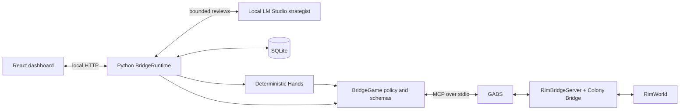

# RimBot architecture

RimBot runs a local RimWorld colony through one model strategist, deterministic
execution, native game tools and a React dashboard. RimWorld owns simulation and
action legality. Python owns decisions, durable intent, reconciliation and player
control. RimBridgeServer/GABS is the sole runtime backend.

## Runtime and ownership

| Piece | Responsibility and source |
| --- | --- |
| Entry and lifecycle | `launch.ps1` prepares/reuses the isolated game and controller; `controller/rimbot/__main__.py` starts FastAPI/Uvicorn on loopback port 8787. `headless.py` prepares separate test profiles. |
| Runtime | `bridge_runtime.py` coordinates observation, reviews, execution, player direction, identity, clock events and rendering. Async guards prevent stale work after direction, plan or load changes. |
| Native boundary | `bridge.py` uses the MCP SDK to launch GABS and discover/call installed tools. `bridge_game.py` restricts gameplay capabilities; `native_contracts.py` validates native arguments and receipts. |
| Game integration | `integrations/colony-bridge/src` supplies colony/status, pawn, item, building, room, zone, cell, research and world reads; construction, installation, settings, bills, orders, trade and dialog actions; clock supervision and rendering demand. The separate identity assembly persists colony identity in saves. RimBridgeServer supplies general game/UI tools. |
| Observation | `bridge_observation.py` preserves raw responses and projects the generated `bridge_models.py` DTO. `data/bridge_observation.schema.json` is its source; `scripts/generate_bridge_observation.py` checks generation drift. |
| Strategy | `planner.py` is the sole strategic authority. `colony_plan.py` separates typed goals, constraints, dependencies and action specifications from mutable execution progress. `strategic_state.py` computes compact signals, trends and review triggers. |
| Execution | `hands.py` compiles semantic steps, validates geometry, records intent and advances native orders. `construction_grounding.py` and `construction_preflight.py` ground definitions and preview placement. `projects.py`, `medical_outcome.py` and `trading.py` reconcile specific outcomes. |
| Inference and advice | `model.py`, `request_budget.py` and `model_router.py` handle local streaming requests, structured-response recovery, context budgets and optional roles. `consultation.py`, `scout.py` and `visual_review.py` supply bounded advice. |
| Knowledge and persistence | `knowledge.py` retrieves local strategy cards; `wiki.py` retrieves reference material. `memory.py` stores advisory colony notes. `review_evidence.py` retains exact review-local results. `store.py` stores state, events and bounded compressed decision checkpoints in SQLite. |
| Dashboard and diagnostics | `bridge_server.py` serves the Vite-built dashboard and state, chat, control, project, notebook, camera and diagnostic endpoints. `dashboard/src/features/manager` renders colony/people, plans, activity and notes. `tool_diagnostics.py` records strategy/native call outcomes. |

Paths in the table without a directory prefix are under `controller/rimbot/`.

## Observe, decide, execute, verify

1. Read native state with start/end ticks. Sequential reads are not an atomic
   snapshot. Unknown fields remain unknown; supply ownership, forbidden status
   and storage are distinct from access, nutrition and safety.
2. Project compact context and meaningful changes. Player direction, changed
   conditions, blocked/completed work and unresolved urgent signals wake the
   strategist. Periodic observation continues; unchanged state does not trigger
   a fixed-interval model review.
3. Discover installed contracts with `describe`. `native_inspections.py` exposes
   typed reads and read-only previews for that review. `execution_contracts.py`
   binds discovered native argument schemas into `commit_plan`/`commit_steps`;
   contracts needed by existing steps are loaded before review. Discovery never
   grants unrestricted game access.
4. Commit a revision-checked plan or append ready steps. Construction uses observed
   definitions, geometry checks and native dry runs before commitment. Dependent
   clearance can defer site readiness to execution. Native-legal blueprints may
   precede material arrival; preview is not a reservation or guarantee of success.
5. Hands executes in Automate, yielding after at most 12 operations per pass.
   It rechecks context and immediate eligibility, persists write intent before
   dispatch, retains partial progress and reconciles fresh observations.

Bill commitments require an explicit mutation action; read-only bill defaults
remain inspection-only. Architect dry runs use the read-only preview path.
Commitment schemas require explicit `dryRun` where the native tool supports it,
matching the gateway's preview/write distinction. Native pawn configuration requires
an explicit pawn identity in discovery as well as execution.

The model cannot issue immediate game writes. Advisers cannot commit plans,
cancel steps or recursively delegate. Only the strategist is configured by
default; analyst/scout, architect/VL and critic are opt-in local roles. Advice,
wiki content and saved notes are not current game facts. Vision concerns require
native verification. Headless mode has no screenshot advisers.
Image consultations and visual reviews capture the current player view with a
source hash and post-capture tick, and discard changed contexts. The tick is not
an atomic screenshot timestamp; cached viewer images are not consultation evidence.

Context budgeting retains complete tool-call groups and reserves output capacity.
Large inspections require narrower queries or explicit pagination. A bounded
review-local evidence store survives conversation compaction and labels recalled
results historical; it does not cache fresh native queries or survive a new review.

## Action and completion contracts

| Committed action | Completion boundary |
| --- | --- |
| `build_room_shell`, `place_buildings` | Native building observations through ProjectBook; a shell does not certify roofing or usable shelter. |
| `create_zone` | Validated native zone geometry/readback; storage and crop production are separate outcomes. |
| `native_operation` | Schema-validated native receipt/readback by default. Bills, settings, designators and UI actions do not imply downstream pawn labor finished. |
| `home/install` through `native_operation` | Exact inner building identity at the intended destination/rotation. |
| Medical native operations | Optional `patient_tended` and `patient_in_bed` wait for fresh living-patient observations. These certify current treatment/delivery state, not full healing or actor attribution. |
| `trade` | Guarded open/stage/preview/accept with participant, content and silver-budget checks; hauling/storage remain separate. |
| `clock`, `stand_down` | Native clock control or verified release of selected current-load AI-owned drafts; neither certifies combat victory. |

Dependencies distinguish orders issued from work complete. Stable step identities
retain receipts; changed intent requires a new identity. Duplicate intent and
cancelled fingerprints prevent recreating the same work under another ID.
Cancelling a plan step does not cancel existing game orders. Observation failures
retain issued work until fresh evidence arrives. Ambiguous non-idempotent writes
block for inspection instead of automatic replay; only explicitly retryable
failures can be retried through the plan.

The observed GABS runtime-state publication fault permits two bounded retries for
approved reads and explicit previews. Mutations and mixed-operation defaults do
not use these retries. Model inspection reports retain native scope notes, and
unavailable power observations cannot clear an established reserve-risk signal.
Selective native building reports include cooler intake/exhaust and vent front/back
cells for current rotation, including intended blueprint/frame geometry. Fogged or
out-of-bounds cell state remains unknown. Unsupported custom thermal classes remain
unknown; geometry alone does not certify cooling or usable rooms.

## Player control and persistence

Startup/reload enters Manual. Saved colony ID plus map scopes durable plans,
projects, direction, memory and trends; a per-load token invalidates in-flight
work. Save after identity attachment to retain identity across game restarts.
Model changes do not erase colony intent. SQLite defaults to
`.rimbot/bridge.sqlite`; `RIMBOT_DATA` can isolate controller state.

`clock_control.py` and native supervised play enforce a lease independently of
model inference (15-second production lease, renewed every 3 seconds). Danger,
injury, lease expiry and external pause/speed changes interrupt work. External
holds require explicit player release. Opening an AI-owned letter pauses its
lease before reading the actual UI; closing a window does not automatically
resume time. `notifications.py` and `dialog_control.py` retain exact native targets.

Strategist reviews pause before observation and inference. Hands runs between
reviews; automatic Normal-speed execution requires confirmed work awaiting native
completion. An automatic window targets 600 game ticks, ending sooner when work
finishes. Explicit model clock steps also get a bounded window; direct player clock
commands retain player control. The controller polls for the boundary, so it can
overshoot. Native danger and lease stops remain independent. Uncapped execution
requires a native tick boundary before it can use this policy safely.
Letter opening requires a fresh empty window list beforehand and identified windows
afterward; existing or unavailable windows require inspection and resolution.

Draft ownership is written before orders and scoped to the load. Manual, review
failure and shutdown attempt pause and verified cleanup; unresolved cleanup
remains durable. Pre-existing player drafts are not claimed. A human
undraft/redraft between observations is still ambiguous.

The gameplay gateway disallows cheat placement, instant gear dropping, boosted
simulation and native watch delays; map trade requires adjacency. Native game
eligibility remains authoritative. The server binds to loopback and guards
dashboard mutations with same-origin/header checks. Model configuration accepts
local HTTP loopback endpoints only, with no paid-provider fallback.

## Presentation, testing and extension

The dashboard polls compact state and keeps drafts/last good data through refreshes.
Interactive game images are periodic snapshots; viewer leases drive native render
demand. `integrations/headless-rim` removes presentation paths in isolated test
profiles. Each campaign worker owns a separate controller, SQLite database,
game profile, GABS runtime and logs; installed game/mod files are shared read-only.

Build output, saves, logs, binaries and measurements belong outside Git. Source
attribution stays beside integrations and in [THIRD_PARTY.md](../THIRD_PARTY.md).
Use [TESTING.md](TESTING.md) for verification and [BACKLOG.md](BACKLOG.md) for all
unfinished work. New capabilities should extend native contracts, guarded
execution and observed postconditions, with focused tests and explicit gameplay
acceptance. The combined autonomous starter colony remains unproven.
