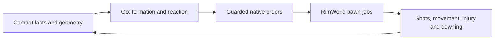

# Combat in the game: the rules the planner works against

[Documentation](../../README.md) · [Architecture](overview.md) · [Weapon planner](../contracts/weapon-planner.md) · [Native rules](../contracts/native-rules.md)

RimWorld owns targeting, pathing, weapon execution and raid state. Go owns squad
composition, positions and tactical transitions. The game constants below are
from the shipped 1.6 assembly; verify them against the installed version before
changing policy. This page describes behavior, not a performance benchmark.

## Hit chance (`Verse.ShotReport`)

`hit = clamp01(aim × (1 − coverBlock))`.

- `aim` is the shooter's accuracy raised to the distance, blended across four bands (touch ≤ 3, short ≤ 12,
  medium ≤ 25, long ≤ 40 cells, long beyond), times the weapon's own factor for that distance, weather
  (only when the shooter or target is unroofed), gas and execution (a prone target within 3.9 cells). A
  darkness offset (Ideology) is added; the total is floored at 0.0201.
- Then times the target's size (pawn body size, clamped 0.5 to 2) and 0.5 for a prone target at 4.5 cells or
  more.
- Cover looks at the 8 cells around the target. Each cover thing blocks its `fillPercent` of shots (0.75 for a
  full-height building, 0 for an open door; the shooter's own cell is skipped). Blocks combine as
  `1 − Π(1 − b)`.

## Target choice (`AttackTargetFinder`, `JobGiver_AIFightEnemy`)

Score for a candidate target: `60 − min(distance, 40)`, plus 10 if it is aiming at me, plus 40 if it was my
target in the last 300 ticks, minus `10 × coverBlock`, minus 50 if downed, minus a non-combatant penalty,
adjusted for friendly fire, times the target's priority factor. Targets are acquired within 56 cells and
kept to 65; a target not engaged for 400 ticks is dropped.

An AI shooter stands and fires (`Wait_Combat`) when it has cover against the target, its cell is free to
reserve and it can hit, or when the target is within 5 cells and it can hit. Otherwise it picks a shooting
position and walks there. The decision is revisited every 450 to 550 ticks, so a raider commits to a
position for about 8 game seconds.

## Raid behavior (`LordJob_AssaultColony`)

A raid is a state graph. Assault is the default toil; sappers start in a sapper toil and switch to assault
when none is left fighting. Raiders give up and leave after 26,000 to 38,000 ticks (33,000 to 38,000 for
sappers and breachers), or when a damage-fraction trigger of 25 to 35% fires; both are filtered to maps
they can exit. Kidnap and steal are separate transitions. Mechanoid raids leave only when the game ends.

The combat fixtures stage the assault lord with `canTimeoutOrFlee: false`, so a fixture fight never ends by
the raiders giving up. Real raids do. Read fixture resolution times with that in mind.

## What the planner should take from this

`combatlab/native-hold` tests the bounded split of Go tactics and native
execution: Go assigns one exact firing cell, holds fire for 600 ticks, then
assigns `HoldPosition` (`Wait_Combat`) and fire-at-will. Subsequent simulation
receives no Go attack, retarget, movement or renewed hold orders. Native shot
events must identify an acquired hostile and a later different live hostile
after reads establish the first target is downed, dead or absent through normal
combat. Every position sample (60 ticks apart) must retain the assigned cell.
The hold-fire phase keeps a live hostile within weapon range and requires no
defender shots. This is a registered nightly gameplay proof, not evidence of a
passed run: its result artifact establishes the outcome. It does not establish
local movement, squad coordination, tactical quality or controller throughput.

An aggressive mental break's subdue response is an owned combat fight. Its
actions retain native's guarded blunt melee and never finish a downed colonist.
An injury or downing of the target or a responder cancels the response and
stops its responders. Uncertain dispatched actions reconcile before the fight
closes and draft cleanup releases claims. A cancelled response cannot attack
the same target again in that incident. Injury stops preserve Auto while the
fight owns the response; the health pause thresholds are unchanged.

- Cover and spacing are scored with the hit formula above; `combat.geometry` already asks the game for cover
  and line of fire rather than reimplementing it. More such reads (hit chance per candidate cell, best
  target per pawn, path cost to the nearest colonist) are the way to borrow more, not a Go port.
- The 8-second shooting-position window and the +40 target stickiness are things focus-fire and
  repositioning tactics can lean on: a raider keeps shooting its current target and does not re-plan for
  several seconds.
- `explainDefensivePositions` treats a hostile inside a standing room or at or behind the firing line as engaged. A hostile outside the walls does not prevent holding solely because it is nearby.

## Measure the response path

Keep detection, stop-to-step, order dispatch and native effect as separate
measurements. A quick wake proves neither a useful tactical decision nor timely
protection. Compare retained flight artifacts under the same scenario and build;
see [throughput](../testing/measure-throughput.md) and
[expert-play evaluation](expert-play-assessment.md#evidence-needed-to-claim-improvement).

## Native execution responsibilities

The game gives every non-drafted colonist a configurable hostility response, `Ignore`, `Attack` or `Flee`
(`pawn.playerSettings.hostilityResponse`). `JobGiver_ConfigurableHostilityResponse` reads it from the Humanlike
think tree and yields to player-forced jobs. Attack engages only nearby enemies (8 cells in melee, 0.66 ×
weapon range up to 20 otherwise) with a static attack; Flee runs to a safe cell and cowers.

Go already owns that setting for every colonist (`policy.DefaultHostility`): Attack for anyone able to fight,
Flee for children, the violence-incapable and the badly hurt, Ignore during stealth work.

Stationary ranged defense uses the existing drafted `HoldPosition` operation
(`Wait_Combat`). Go owns the firing cell and tactical transitions; RimWorld
acquires and switches targets. Eligible roles are ordinary firing-line holders
with known plain ranged weapons. Retreats, tactical detachments, melee duties,
repair, mortars and specialist weapons retain their existing orders. Spared
bleeders and nearby exploding animals require targeted control because native
acquisition cannot honor those target exclusions.

Arrival installs the hold once. An observed `Wait_Combat` at the assigned cell
keeps it valid across target changes. Formation and safety decisions may replace
it with another order; the current implementation does not establish a complete
role-specific response to every breach or unreachable cell (see the roadmap). Owned-draft and
Manual authority gates still govern every order and cleanup.

Recorded-fact tests cover production assignment and deduplication.
`combatlab/native-hold` covers stationary acquisition and target switching;
its retained result establishes whether a run passed. It does not prove local
repositioning, pursuit, squad coordination or expert tactical quality.
