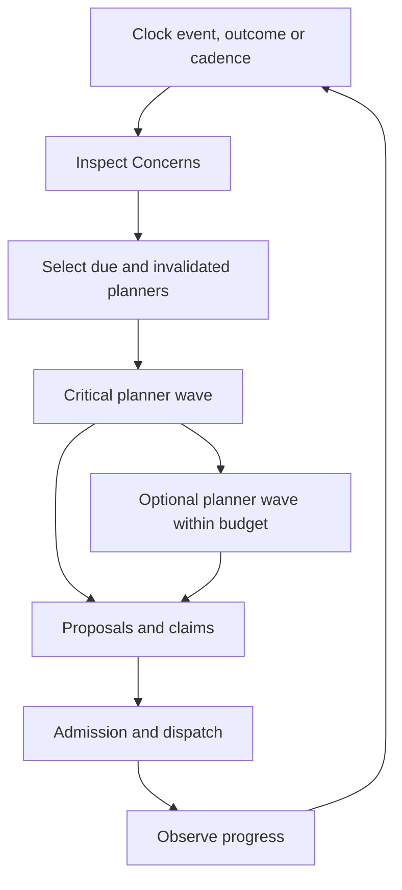
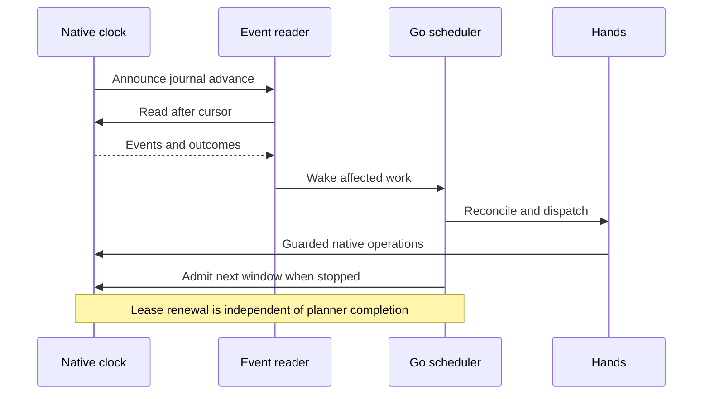

# Control loop

[Architecture](overview.md) · [Controller contracts](../contracts/controller-contracts.md)

The governor inspects the colony, selects bounded work, issues orders and observes
progress. The scheduler and native clock operate independently of launcher refresh.

## Concerns and their forms

A **Round** runs **Inspections** on **Concerns**, grouped into **Departments**.
A selected **Method** pursues a Concern through a Plan of actions.
**Safeguards** veto unsafe admission; they pursue no outcome themselves.

| Type | Inspection | Lifecycle |
| --- | --- | --- |
| Standard | Finding: Met, Unmet or Unclear | Maintains a target; a settled target becoming unmet starts a new Episode. |
| Project | Finished-state and prerequisite checks | Completes once; if the finished state later breaks, a new Project can open. |
| Incident | Situation: Active, Clear or Unclear | One occurrence, opened by a trigger and closed by observed clearance. |

Departments group work in the launcher. They do not allocate exclusive workers.
`policy.ConcernTypeOf` and `policy.DepartmentOf` own the classification, with
tests for unclassified Concerns; do not maintain a second ID inventory in prose.

Durable intent and session Method ownership are defined by the
[persistence contract](../contracts/persistence-contracts.md).
The [glossary](../glossary.md) defines the shared terms.

## Observe and prioritize

Native frames provide coherent facts at an observed tick. Independently fetched
reads can span world changes, so identity and authority still require validation.
Absent or incomplete observations remain unknown; forecast harvest is not stock.

The planner catalog declares required sections, fact families, action kinds and
tick cadence. The due queue selects dirty or due planners. Action outcomes wake
their consumers; invalidated fact families wake their readers; authority changes
force reconciliation. Tests reject undeclared planner reads.

Critical planners precede optional work. Startup shelter can be promoted.
The planner-wave wall budget starts after the Rounder's review; it is not an
end-to-end response deadline. See the
[expert-play roadmap](expert-play-assessment.md) for the proposed stronger bound.

### Routine work admission

Vanilla work priorities schedule queued pawn jobs. Concerns do not reserve
exclusive development slots. Method ownership, open work, Safeguards,
dependencies and per-planner bounds prevent duplicate or unsafe admission.

Migrated planners use shared proposal arbitration by priority, urgency and stable
ID, with claims on pawns, entities and quantities. These claims are not a complete
colony-wide labor forecast. Supply planning accounts for its own labor and lead
times; [resource demand](supply-model.md) feeds material shortfalls back into
acquisition.

Admission is action-specific. Building intent-mode can defer placement/cost
checks to execution; native dispatch still validates current placement.
Do not infer a universal atomic reservation of every future construction cost.

## Execute under supervision

Native grants bounded tick windows under a renewable wall-clock lease.
A routine window permits up to 60,000 ticks; combat uses a 300-tick backstop.
Native allowances, hazards and player input may stop either earlier. Lease
expiry stops control when the controller becomes unresponsive.

Routine reads and orders can run during a window. Only admitting the next window
requires the stop boundary. A coherent frame binds planner facts to its tick;
dispatch revalidates current context and the action's native contract.

### Event delivery

The native journal is authoritative. Each append announces its cursor on the
`rimgovernor.clock` GABP channel; Go reads after its own cursor through an
unheld `clock_read_events`. A bounded poll catches missed announcements.
Subscription/reconnection triggers a tail read, and page loss remains explicit.

Events wake scheduler and worker. Named action outcomes reconcile first.
A stop may warm admission observations, reusable only when tick, identity,
generation and invalidation state still match.

Routine operation outcomes wake work without stopping simulation. Combat windows
may watch terminal construction/haul attempts, allowing a stop at their outcome
tick. Coupled orders wake when their prerequisite outcome arrives.

### Step reasons

| Trigger | Work |
| --- | --- |
| Settled window, tick advance or safety-net review | Full planner reconciliation |
| Timer | Due planner entries; admission alone when none is due |
| Outcome/fact wake | Affected planners; authority changes expand to all |
| Running window | Live planning and dispatch; no new window admission |

`clock_step` records why a step ran and its admitted window.
`stop_latency_ms` measures native-stop-to-step time, not hazard onset to
protective effect. Precise clock guards live in the
[clock contract](../contracts/go-clock-recovery.md) and
[hazard bounds](hazard-detection-bounds.md).

## Manual control

Manual authority suspends automation in the current world. Resuming Auto permits
the governor to act on current colony deficits immediately, including work the
player drafted, restricted or placed. There is no per-subsystem ownership grace
period. Forced or queued work can influence preference without excluding a pawn.

Pause retains routine Concerns and open work. Colony/map/load changes or tick
rewinds invalidate old context. Explicit Pause does not undraft pawns; native
auto-undraft applies while authority is inactive. Informational letter pauses
may stop a window without holding automation.

### Drafts

Drafts are plan-owned. The census-based cleanup undrafts colonists no live plan
or open fight needs, while protecting native arrest/capture jobs. A suspended
plan retains drafts needed by unfinished work; subsequent orders still check
that a pawn remains drafted.

### Auto takeover

Under Auto, timetable, diet, Home, allowed-area, bill and standing designation
edits are ordinary colony facts. Their owning planners reconcile them through
the shared action system. Destructive work still requires its explicit
eligibility and opt-in guards. See
[durable policy](../contracts/durable-policy.md).

## Verify progress

Hands tracks action-specific receipts and postconditions. Concern progress tracks
the desired colony outcome and its blocker: no worker, native ineligibility,
uncertain write or unavailable method. Unknown observations cannot settle it.

Observed stalled work can trigger a bounded cooldown or alternate method.
Completion can clear the blocker without replacing the action's evidence.
A colony stage summarizes combined survival and development criteria; it does
not guarantee future stability or reserve workers.

[Controller contracts](../contracts/controller-contracts.md) define disease,
hunting, combat extensions and stage criteria.
