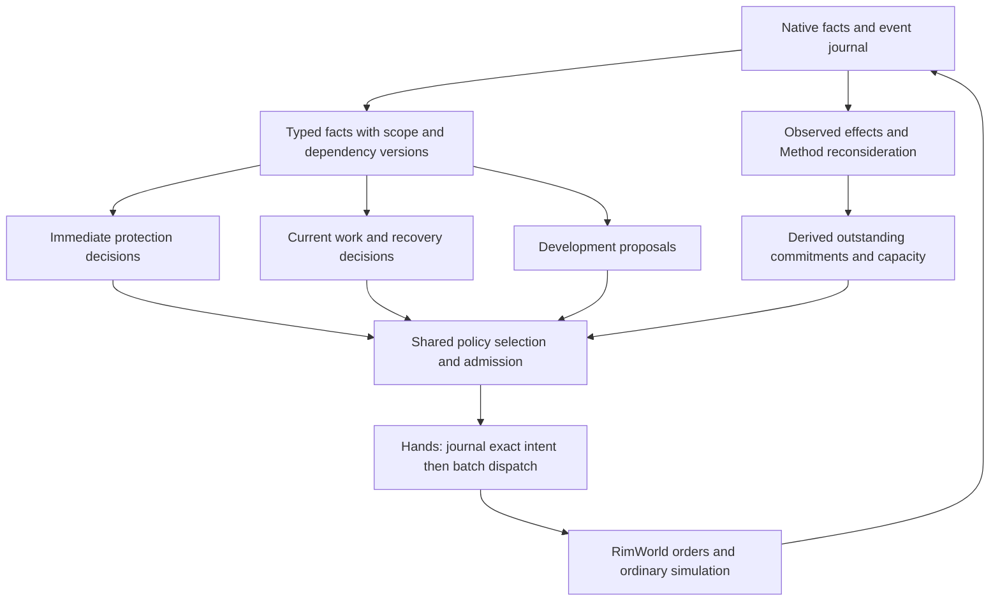

# Architecture assessment for expert play

[Documentation map](../../README.md) · [Current architecture](overview.md) ·
[Architecture rules](rules.md)

## Recommendation and scope

Strengthen the existing deterministic control architecture in place. Its main
limitation is uneven application of shared contracts: food and resource supply
coordinate some capacity, ordinary actions have a journaled executor, and
critical planners have scheduling priority, but those guarantees do not yet
cover every commitment, write path, or part of response latency.

The requested outcome is fast simulation, timely protection, efficient colony
development and expert combat. The target design below is a proposal for that
outcome, not a description of implemented behavior. It retains Concerns,
Methods, Rounds, Safeguards, Hands and vanilla pawn scheduling. It adds no
second governor, model dependency, workflow engine or persistent world model.

Source assessment: `5451e21f098f49e94eb1a8a1e0bd1fb9f7a8b741`. Evidence is
code, test definitions, contracts and the linked issue reports. No live colony,
performance capture or human comparison was run for this assessment. A test
definition establishes intended coverage; it does not establish current native
success. Gameplay effects described as risks are hypotheses to measure.

## What is already worth preserving

| Existing mechanism | Evidence | Architectural value |
| --- | --- | --- |
| Pure deterministic decisions | [Policy gates](../../../go/internal/archgate), `DecideCombat`, `PlanSupply` | Replay decisions without a game or model call. |
| Selective planning | [Planner catalog](../../../go/internal/buildingruntime/clock_planner_catalog.go), [due queue](../../../go/internal/buildingruntime/clock_planner_queue.go), [read audit](../../../go/internal/buildingruntime/clock_planner_reads_test.go) | Declared sections, families, action outcomes and tick cadences already select work; tested undeclared reads fail the package. |
| Shared proposal arbitration | [Proposal and claim coordinator](../../../go/internal/buildingruntime/proposal.go) | Migrated planners compete deterministically by priority, urgency and stable ID, with named claim conflicts. |
| Supply forecasting | [Food view](../../../go/internal/policy/food_plan.go), [resource supply](../../../go/internal/policy/resource_supply.go), [ranker](../../../go/internal/policy/supply_plan.go) | Lead, risk, labor, multiple yields and demand horizons already inform acquisition. |
| Journaled ordinary execution | [Executor batch path](../../../go/internal/executor/intent.go) | Prepare and dispatch are journaled before the native write; batches avoid one call per order. |
| Native supervision | [Hazard constants](../../../integrations/rimgovernor-native/src/Bridge/SupervisedPlayHazards.cs), [detection contract](hazard-detection-bounds.md) | Tick-paced hazard detection, direct hooks and expiring authority protect the simulation independently of planner speed. |
| Multiple evidence levels | [Supply simulator](../../../go/internal/supplysim), [snapshots](../../../go/internal/snapshot), [combat lab](../../../go/internal/nativeaccept/cases/combatlab), [campaigns](../../../go/internal/nativeaccept/cases/campaign) | Decision quality, boundary behavior and actual gameplay can be evaluated separately. |

The shared plan is more than a collection of unrelated work, but it is not a
single colony-wide forecast of feasible completion. Material claims, supply
labor, worker eligibility, and tactical pawn claims solve different portions
of coordination. Unifying their meaning should precede adding more priority
numbers or admission guards.

## Three traced paths

### Disaster protection and recovery

1. Native conditions and pawn/building facts enter the observed colony.
   [Hazard supervision](../../../integrations/rimgovernor-native/src/Bridge/SupervisedPlayTool.cs)
   evaluates tick-paced probes separately from fact-change digests. The declared
   general probe interval is 30 ticks; condition digest fallback is 600 ticks.
   These are different contracts, not one universal reaction deadline.
2. [ReviewDisaster](../../../go/internal/policy/disaster.go) derives service
   deficits and a phase from observed conditions and infrastructure. Expiring
   forecast time alone does not prove restoration. `DisasterHistory.Promote`
   raises affected Concerns' priority.
3. [RoundsRecoveryPlanner.step](../../../go/internal/buildingruntime/rounds_recovery.go)
   re-reads owned facts, derives `PlanSheltering`, cancels obsolete area actions,
   and waits on still-open work. Area changes precede repair/refuel selection.
   [SelectRecoveryMethods](../../../go/internal/policy/recovery_method.go)
   checks known worker/safety facts; the planner claims the selected pawn and
   commits an Incident Method.
4. `RecoveryServiceAction` uses the [ordinary intent executor](../../../go/internal/executor/intent.go).
   Its applied receipt completes the service-order intent. Restoration remains
   a later observed service/infrastructure result in `ReviewDisaster`.

**Assessment:** there is a useful protection-first policy and an observed
recovery model. The remaining architectural question is how quickly the entire
path can act while unrelated development is expensive, and how recovery work
competes with already committed routine work. Neither is proved by the hazard
probe's bound.

Existing evidence includes [disaster policy tests](../../../go/internal/policy/disaster_test.go)
for temporary survival and false recovery, [recovery selection tests](../../../go/internal/policy/recovery_method_test.go),
and [campaign/recovery](../../../go/internal/nativeaccept/cases/campaign/recovery.go).
The latter stages a wood shortage followed by a raid and checks native colony
outcomes; it is not evidence for every environmental disaster or simultaneous
resource/labor conflict.

### Development under food and material pressure

1. [Rounder.reviewStep](../../../go/internal/buildingruntime/rounds.go) derives
   food, layout, resource demand and work requirements from observed facts and
   current commitments. [Layout review](../../../go/internal/buildingruntime/colony_plan.go)
   preserves built/in-flight rooms and throttles growth/survey work.
2. [planFood](../../../go/internal/buildingruntime/rounds_food_plan.go) calls
   `SupplyFoodPlan`, which calls `PlanSupply`. Then
   [buildResourceSupply](../../../go/internal/buildingruntime/rounds_resource_supply.go)
   plans resource candidates with the labor food leaves. This is one ranker
   reused in sequential plans, not one joint optimization over all colony work.
3. [Work requirements](../../../go/internal/buildingruntime/rounds_work_projects.go)
   connect open buildings/bills to required work types and skill floors.
   These establish eligibility, not remaining work duration or completion time.
4. Shared proposal claims and family admission commit Methods. In
   [AdmitBuildingMethod](../../../go/internal/store/standard_admission.go),
   building intents are not priced/sited by the generic candidate admission;
   native application checks them. Family funding matters: for example the
   [defense pipeline](../../../go/internal/buildingruntime/rounds_defense_pipeline.go)
   tracks open tier costs and cells. The broad statement that every building
   goes through the same resource-preview admission would be inaccurate.
5. Hands places orders in batches. An applied blueprint is an intent outcome;
   the owning Concern must still observe its desired building/service result.

**Assessment:** supply decisions already include lead and labor. The missing
guarantee is that all competing commitments fit the same meaningful capacity
estimate. `resourceLabor` subtracts food channel labor from `workers * 20000`;
it does not deduct all construction, medical and recovery commitments.
`stepBudget` in [ClockScheduler](../../../go/internal/buildingruntime/clock_scheduler.go)
supplies resource stock to proposal arbitration, not a work-type/time model.
This creates a risk of overcommitment; this assessment does not claim a measured
starvation or development regression from it.

There is also a direct contract violation: `resourceLabor` returns
`Known(1e12)` for unknown workers, explicitly grandfathered in the
[rule 5 baseline](../../../go/internal/archgate/baseline/rule5.txt).
Track its removal in [#2501](https://github.com/davidarcher/rimgovernor/issues/2501).
The existing [#2494](https://github.com/davidarcher/rimgovernor/issues/2494)
already owns inconsistent demand assembly; [#2500](https://github.com/davidarcher/rimgovernor/issues/2500)
owns where decided-but-unplaced bill ingredients belong. Complete those before
introducing a broader commitment calculation.

The [food matrix](../../../go/internal/buildingruntime/supplysim_food_test.go)
and [resource matrix](../../../go/internal/buildingruntime/supplysim_resource_test.go)
already exercise real planning adapters with shrinking failure baselines.
Their simplified flow worlds support policy comparisons, not claims about
native pathing, actual pawn throughput or expert play.

### Combat response and return to ordinary work

1. Native combat events stop an armed window at its event boundary; the
   [combat-stop contract](hazard-detection-bounds.md#armed-combat-stops) also
   defines a 300-tick controller backstop. Detection/stop time is not the
   time at which a defender has reached safety.
2. [RoundsDefensePlanner](../../../go/internal/buildingruntime/rounds_defense.go)
   builds a combat view and supplies native geometry to
   [DecideCombat](../../../go/internal/policy/combat_decide.go). Policy retains
   roles and memory, emits changes, and generally avoids interrupting aim except
   for protective actions. Formation and reaction are already distinct phases.
3. [admitFight and sendCombatBatch](../../../go/internal/buildingruntime/rounds_combat.go)
   commit fight ownership, then send draft/orders through
   [bridge.CombatOrders](../../../go/internal/bridge/combat_orders.go), which
   creates an ActionsWriter and applies directly. Subsequent stops call
   `issueCombatOrders` before `RecordCombatStop`. Exact batch execution therefore
   bypasses the ordinary executor's prepare/dispatch journal lifecycle.
4. Results update refusals and combat memory; fight closure and the draft sweep
   release the roster. Current `combatStopRecord` also sets `Applied` when the
   result slice is nil, while its comment calls that receipt uncertain. The
   target contract should represent uncertainty explicitly.

**Assessment:** keep pure tactics, incremental orders, native geometry and
single-call batches. Bring their execution under the documented Hands owner
without adding per-order round trips. [#2502](https://github.com/davidarcher/rimgovernor/issues/2502)
owns this boundary repair. Native receipt replay and current-world guards
already reduce risk; no crash-induced duplicate effect was reproduced here.

Reconsideration is also uneven. `reform` has shared triggers (including an
unreachable role) and several tactic-specific cases, but no shelter-specific
exit on newly available defenders. [#2355](https://github.com/davidarcher/rimgovernor/issues/2355)
tracks that problem. [#2354](https://github.com/davidarcher/rimgovernor/issues/2354)
tracks shelter geometry/refusal handling. Its historical examples are issue
evidence, not measurements rerun for this assessment; the current code already
contains some later defended-side clamping.

[Decision tests](../../../go/internal/policy/combat_decide_test.go) cover
determinism, changed orders, warmup protection and formation. The
[combat metrics cases](../../../go/internal/nativeaccept/cases/combatlab/metrics_case.go)
record casualties, damage and resolution/latency evidence and explicitly call
themselves evidence rather than a quality gate. Having them registered does not
prove expert tactical results.

## Cross-cutting findings

| Finding | Confidence and consequence | Work owner |
| --- | --- | --- |
| Combat has a planner-owned write path | Confirmed call path; inconsistent write-ahead/recovery ownership | [#2502](https://github.com/davidarcher/rimgovernor/issues/2502) |
| Unknown capacity becomes a number | Confirmed code and baseline; optional work may be planned without known capacity | [#2501](https://github.com/davidarcher/rimgovernor/issues/2501) |
| Critical planners wait for the shared review | `stepPlanners` runs Rounds first; `runPlanners` starts its wave budget afterward. Structural latency exposure, not a measured timing failure | [#2503](https://github.com/davidarcher/rimgovernor/issues/2503) |
| Coordination is partial across work types | Supply labor and proposal stock claims exist; inspected interfaces do not establish a colony-wide completion budget | [#2504](https://github.com/davidarcher/rimgovernor/issues/2504), after #2494/#2500 |
| Continuation rules differ by family | Concrete combat cases above; generalization to a shared contract is proposed | [#2505](https://github.com/davidarcher/rimgovernor/issues/2505), with #2354/#2355 |
| Expert-level quality lacks a demonstrated reference here | Existing metrics are reusable; no matched expert comparison was inspected or produced | [#2351 evaluation requirements](https://github.com/davidarcher/rimgovernor/issues/2351#issuecomment-6072514979) |

Decision validity also needs a precise distinction. Current
`proposalStale` checks scope and plan revision, deliberately not tick age; native
apply validates legality. A legal action can still be an obsolete strategic
choice. #2503 should make relevant policy invalidation explicit, rather than
introducing a universal short expiry that prevents development from finishing.

## Target design

The three decision horizons are responsibilities inside the existing policy and
scheduler, not three new services. Native supervision retains its separate
clock/authority responsibility. Existing leased native rules remain the
documented exception: Go authors and journals attachment, native executes only
the whitelist and journals each firing.

### Contracts to make uniform

| Contract | Owner and smallest change | Verification |
| --- | --- | --- |
| Facts used to decide remain valid for that decision | Observation supplies scope/versions; extend the existing planner catalog and proposal validation with relevant invalidations | Same relevant facts give the same decision; unrelated changes do not cancel it; changed prerequisites do |
| Exact automated intent is journaled before any write | Hands/executor; move the combat batch into its existing batch mechanism | Interrupted-write tests plus a production call-site ownership gate |
| New commitments respect protected survival work | Pure policy over one demand value and derived open work; admission consumes that result | Competing work scenario with known/unknown capacity and order-independent selection |
| Urgent protection does not depend on unrelated development | Existing scheduler and native supervisor; narrow the pre-wave review dependencies | Synchronized blocked-development test plus native onset-to-effect evidence |
| Every Method has explicit continuation and exit conditions | Family policy owns prerequisites, expected outcome, progress horizon, invalidation and release; reuse existing Method identity | Stable-input, refusal, lost-prerequisite, recovery and restart transition tests |
| Unknown stays unknown | Typed facts at every calculation boundary; remove the sentinel first | Known-zero/unknown/known-positive tests and shrinking baselines |

Keep domain calculations in policy. Runtime gathers facts and sequences work;
the bridge validates/translates wire contracts; the store records intent and
outcomes. Forecast work capacity first by bottleneck work type and horizon,
with known or unknown estimates. Avoid exclusive long-lived pawn reservations
for routine jobs: vanilla still schedules ordinary work. Emergency exact-pawn
claims remain appropriate where a specific pawn must act.

The decision ordering proposed for #2504 is explicit: satisfy authority and
legality, protect immediate survival obligations, preserve useful commitments,
then rank optional progress by benefit, lead and scarce capacity. This is a
design assumption motivated by the user's goals, not an implemented global
ranking or a guarantee that every death is preventable. Avoid reducing safety,
wealth and speed to one weighted score.

### State and complexity budget

Use the existing [persistence table](../contracts/persistence-contracts.md):
player targets and durable intent belong in save-owned records; exact attempts
and outcomes belong in the session journal; fact views, residual capacity and
forecasts are derived in memory; diagnostic decisions use `flight.jsonl` with
an existing reader or a reader added with the row. Any genuinely new durable
fact must amend that table before implementation. Capacity must be recomputed
from observed work and saved intent after load, not restored as a second ledger.

Before adding machinery, delete the earlier cause where possible: the combat
write bypass, duplicate demand assembly, the numeric unknown fallback, and
unrelated dependencies in urgent review. Keep specialized policy where the
game has genuinely different rules; a generic strategy framework has no
demonstrated benefit yet.

## Evidence needed to claim improvement

| Dimension | Measure and baseline | Existing home |
| --- | --- | --- |
| Throughput | Governed wall TPS divided by the same fixture's ungoverned TPS; native pause fraction; observation main-thread cost | [Speedmatrix and observation workload](../testing/measure-throughput.md) |
| Protection | Onset → detection → decision → dispatch → first native protective effect in ticks; stop → resume in monotonic wall time | Hazard cases, scheduler tests, combatlab and flight traces |
| Disaster recovery | Duration of unmet food/temperature/medical obligations; native restoration; losses in declared scenarios | Campaign/recovery plus focused staged cases |
| Development | Time to useful completed capability; outstanding work and disrupted work; survival reserves during construction | Snapshot decisions, supply matrices and campaign/foothold |
| Combat | Deaths, injuries, friendly fire, refusal recurrence, threat resolution and return to productive work | Combatlab metrics and recorded decision replay |
| Robustness | Authority changes, interrupted writes, missing facts and fresh-store resume preserve the contracts | Executor/store boundary tests and #2351 continuity work |

No current numeric performance baseline or expert score is asserted here.
Thresholds must be fixed from a declared baseline before judging a candidate:
same save/seed, mod set, difficulty, hardware, speed and workload; measure
repeat-run noise and retain held-out scenarios. Use reviewed expert choices
for tactical/strategic replay and recorded human runs where feasible. Previous
governor versions establish improvement, not expertise. Safety outcomes are
reported separately so higher TPS cannot conceal worse survival.

Representative proving scenarios:

- **Recovery:** urgent repair and an injured worker during food pressure;
  protect food/care, restore the observed service, then resume development.
- **Development:** one scarce capable work pool supporting cooking and optional
  construction; count current commitments once, defer infeasible new work,
  and resume it when capacity returns.
- **Combat:** a sheltered colony gains eligible defenders while a prior retreat
  is refused; reconsider the tactic, choose reachable protection, and return
  survivors to normal work after the threat ends.

Policy choices belong in fast replay tests. Native cases cover movement,
actual service restoration and game-rule effects; they start at staged
preconditions. Longer campaigns provide interaction evidence, not a replacement
for those focused proofs. Reuse #2351's evaluation infrastructure rather than
create another benchmark service.

## Migration sequence

| Milestone | Concrete result and exit criterion | Removal and risk control |
| --- | --- | --- |
| 1. Restore existing contracts | #2501 preserves unknown labor; #2502 puts exact combat batches through journaled Hands. Existing replay and interruption tests pass; batching is retained | Delete numeric fallback and planner-owned writer. Preserve native replay identity and authority guards |
| 2. Complete shared inputs | #2494/#2500 settle one demand calculation and the ownership of planned ingredients. Detector, planner and trade retention consume the same result | Delete duplicate merges; no additional demand store |
| 3. Protect the response path | #2503 declares response stages and narrows unrelated review dependencies. A blocked development read cannot block the critical protective intent; native timing is measured | Keep one scheduler, one writer and lease supervision; do not use tighter test deadlines as proof |
| 4. Make continuation explicit | #2354/#2355 and #2505 establish combat-shelter and recovery transitions, including unknown/refused observations and recovery to normal work | Replace duplicated family guards where the shared rule applies; preserve stable useful orders |
| 5. Coordinate scarce capacity | #2504 proves the cooking/construction/recovery conflict through existing admission. Optional work resumes after the constraint clears | Derive capacity from existing work; no exclusive routine-worker slots or general solver |
| 6. Qualify playing strength | Extend #2351 with the scorecard, repeat-run noise and expert reference; demonstrate improvement on the three proving scenarios and held-out cases | Reuse current report formats; report coverage and uncertainty instead of a universal expert claim |

Begin baseline/report work with milestone 1 so later changes have a comparison.
Milestones 3 and 4 can be implemented as separate coherent slices once their
shared interfaces are understood; milestone 5 depends on shared inputs. Each
slice changes one existing owner, lands independently, and removes the old
path when its replacement is complete. This deliverable authorizes no runtime
migration by itself: implementation scope is in the linked issues.

For each implementation milestone, run the required `cmd/test` once and follow
[choose-tests](../testing/choose-tests.md). Native acceptance remains nightly
evidence rather than a new pre-landing gate; run a focused case earlier only
when it answers an identified native question. A green short suite certifies
neither end-to-end latency nor expert play.
