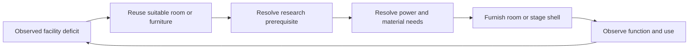

# Facilities

Room functions are the game's own `Room.Role`; the controller never assigns a
role, it only reads which one the game scored. `policy.FacilityCatalog` is the
per-role matrix over every installed RoomRoleDef, and every planner that
pursues a role walks the same ladder. This page is the ladder and the matrix;
[space and resources](space-and-resources.md) covers siting and budgets.

## The ladder

Each rung is a separate deficit under an existing maintained Concern. Shared
admission checks its resources and dependencies; vanilla priorities schedule pawn work.

1. **Reuse**: a room the game already scores as hosting the function, or an
   existing bench, bed or spot that already does the job. Reuse always wins
   over building, so a colony that has the facility never gets a second one.
2. **Research**: when the first bench that could produce a `MaintainResource`
   deficit is gated only by unfinished research, the workshop planner records
   the projects on the `production_ladder` journal record and steps aside. The
   next rounds read that record as the derived `EnsureResearch`
   target (`policy.ResearchConcern`: the default research ladder follows when no need is
   recorded, see [research](../contracts/research.md)), raises the concern, and
   adds Research to the work requirements so a researcher is assigned;
   `RoundsResearchPlanner` selects the prerequisite chain natively.
   Finishing the project clears the record on the next workshop step.
3. **Power**: a bench that needs power is staged only once a generator
   definition is buildable; standing unpowered it is an ordinary consumer for
   `EnsureBasicPower`, which raises its own deficit and connects it.
4. **Bench**: the first candidate bench the planning census reports available
   and buildable by a builder the colony has (unpowered before powered) is
   furnished into a hosting room, or the starter shell is staged first.
5. **Workstation stockpile**: not a method. Industry declares, for every bench
   with an active bill except the kitchen's and butcher's, one Important
   allow-list store of that bench's recipe ingredients
   (`policy.DeriveBenchInputs`) on the free roofed 2x2 patch in the bench's room
   nearest it; hauling brings the inputs to the bench. All stores are declared by
   their departments and applied by `MaintainStockpiles`: see
   [storage](storage.md). Once ComplexFurniture is researched,
   `RoundsStorageShelvesPlanner` places a Shelf inside the warehouse, up to a
   third of its footprint; `MaintainStockpiles` patches each built shelf with its
   zone's filter and priority (role `shelf:<buildingID>`). Native storage
   capacity counts a shelf cell's free slots (three stacks per cell).
6. **Bill**: `RoundsResourcePlanner` dispatches the bill and native readback
   of the rising item count carries the deficit to recovery. Native
   applies a bill on an unfueled bench (`UsableForBillsAfterFueling`):
   a bill waiting on the bench is what makes haulers refuel it, and a bench
   with no bill leaves the clock with no work to run those hauls under.

Each rung reports an explicit reason when it cannot proceed
(`workshop_research_needed`, `workshop_bench_unavailable`, `no_space`,
`unknown`) rather than staging something else. A research bench itself is the
Laboratory row: when the research ladder's next rung is locked only for lack
of a bench, `RoundsResearchPlanner` walks the same furnish-or-shell ladder
under `EnsureResearch` for a `SimpleResearchBench` (`routine-laboratory-*`
plans) and selects the rung once it stands. A table still standing in a retiring
shelter is packed with the rest of the retired ground and installed in the
laboratory from stock; no separate pass relocates it.

## Electrical safety

`EnsureBasicPower` uses `HiddenConduit` for new connections and replaces ordinary
conduits in bounded eight-cell methods. Turret connections use the same safe
definition. Native research, placement, stock and construction checks still apply;
unknown blockers, forbidden conduits and unfinished work cannot be replaced.
The topology census includes ordinary, hidden and waterproof conduits.

Native power facts identify rain-sensitive equipment and whether its whole
footprint is roofed. Exposed equipment and ordinary conduits keep power at
priority 2 even in dry weather. Where a free, observed perimeter exists, the power
planner builds a small enclosure around exposed equipment through shared Hands.
The door precedes the walls in one wave; ordinary colonist roofing has a bounded allowance,
and only an observed roof clears exposure. Blocked sites remain a deficit.
New rain-sensitive equipment requires a finished roof at placement admission.

These are separate hazards: roofing batteries and appliances prevents rain
shorts; roofing ordinary conduits does not prevent the random conduit incident.
See the wiki's [hidden conduit](https://rimworldwiki.com/wiki/Hidden_conduit) and
[battery](https://rimworldwiki.com/wiki/Battery) mechanics, and
[disaster recovery](../contracts/disaster-planning.md) for incident evidence.

## Room capabilities

`policy.FacilityCatalog` is the authoritative per-role capability matrix.
Installed definitions and DLC determine which facilities exist. The sections
below describe their planning contracts; they are not an implementation-status
checklist.

### Child rooms (Biotech)

A baby, toddler or child is owed the room its developmental stage calls for
(`policy.ChildRoomNeeds`, from the pawn row's `biotech` block): a nursery
while a newborn or baby lives, a playroom while a baby or child does, a
classroom while a child does. The roles are the game's own room scores
([Rooms, Roles](https://rimworldwiki.com/wiki/Rooms)): a Nursery scores 0
under two baby beds or beside any other bed, a Playroom scores each toy box
and baby decoration and a Classroom each blackboard and school desk, both
only while the room holds no humanlike bed. Furniture counts follow the
pawns: a bed per newborn or baby (at least the game's two), one toy box and
one decoration, one blackboard and a desk per child.

Furniture is never a def-name list: the native definition catalog gives each
`PlanningDefinition` view its `RoomRoles` (`BabyBed`, `Toy`, `Decoration`, `Board`,
`Desk`, `DeathrestCasket`, `DeathrestAccelerator`; see
[observations.md](../../../contracts/proto/observations.md#room-role-furniture))
and a room's pieces are the catalog definitions carrying the role, the first
available by name placed. The same machinery owes a **deathrest chamber**
while a deathrester lives: a casket per deathrester and, as an optional piece
(left out when no accelerator is available), the accelerators its deathrest
capacity beyond the casket allows.

1. The layout review grows a `nursery`, `playroom` or `classroom` core room
   sized to hold the furniture (`policy.ChildRoomSizes`,
   `policy.ReplanLayoutWithRooms`); existing rooms never move or shrink.
2. `NextChildRoomStep` owes the room a reconcile (`ChildRoomReconcile`)
   whenever its ring or doors differ from the plan or a piece is missing. The
   step carries the template: each role's standing pieces wanted where they
   stand, the missing ones at free slots of the child room template (bands of
   free floor as high as the piece, a free row between bands, the row inside
   the entrance and the entrance column kept free). The shared build side
   does the work (`reconcileRoom`, as for the throne room below): removals,
   installs from packed stock, then doors, walls, floors and furniture built
   on site; there is no shell or place step. Only the template's pieces are
   the room's: other furniture is left alone. Footprints are the native
   definition catalog's; a role whose required furniture is unavailable or has
   no known size is passed over, and any available definition of the role
   answers an unresearched one.
3. Feeding is `MaintainBabyFeeding` (below); play and lessons belong to the
   next children.

### Baby feeding (Biotech)

The game feeds babies itself: a lactating pawn breastfeeds any baby, and a
colonist on Childcare work (pinned for every pawn) bottle-feeds food a baby
can eat, which is baby food, milk or insect jelly
([Baby, Food](https://rimworldwiki.com/wiki/Baby); the def flag is
`IngestibleProperties.babiesCanIngest`, read from the def row by
`DefinitionCatalog.BabyEdible`).
The mother is Urgent and every other pawn Childcare by default. No write
beyond the existing production bill is owed. `MaintainBabyFeeding`
(priority 2, Food domain) is raised while babies live, no colonist can
breastfeed and the shared stock a baby eats (stocks whose eaters include a
baby) is under the game's low-baby-food alert level per baby
(`policy.BabyFoodAlertNutrition`, `Alert_LowBabyFood`). It places one
standing target-count bill for the baby-edible recipe (bulk first) through
`ProductionBillIntent`, sized to the babies' native nutrition per day over
the seasonal food target days, less other baby foods in stock.
Native's human-food test (ColonyFacts census, cooking recipes, food storage
zones) judges each food per eater class: a baby is an eater only of a
`babiesCanIngest` food (the game's `FoodIsSuitable`), so a baby in the colony does
not remove meals from the human food census.

### Polluting-machine siting (Biotech)

A building whose catalog row has `Pollutes` known true (a toxifier,
pollute-over-time or wastepack-producing comp, read natively) is sited by
`policy.PollutionSites`: it ranks the caller's legal candidate footprints by
distance only (no wind term; no sourced rule). Farthest from the nearest field
zone, bedroom, living-room or polluted cell first, then nearest the wastepack
disposal (atomizer) cells, then by cell order. The function is pure: it holds no
reservation and sets no threshold, so a concern (mech gestation, charging) takes the
first ranked site its native placement preview accepts. Unknown or off-map input
is an error, never a guess.

### Worship room (Ideology)

An ideoligion that requires buildings is owed one worship room holding one of
each. `Ideoligion.RequiredBuildings` names them (the ideology section:
building precepts' ThingDefs and the held rituals' required buildings, from
the game's defs; [ideology contracts](../contracts/ideology-contracts.md)),
and `policy.WorshipRoomNeed` turns them into a child room need
(`ChildRoomNeed`, one of each), so the room is grown and reconciled to its
template exactly like the child rooms above. The names are the
ideoligion's and the footprints the definition catalog's: no def is listed
in Go. The review names the required buildings for the catalog and
remembers them for the planners' reads. Without Ideology or a primary
ideoligion, or while any required building is unavailable or has no known
size, no room is owed. The ideology read carries no room-quality
requirement, so none is staged.

### Containment cell (Anomaly)

A living entity the game lets the colony capture (`can_be_captured`, not yet
held) with no standing platform able to hold it owes one containment cell:
its own planned room holding one holding platform, reconciled exactly like the
worship room (`policy.ContainmentCellNeed` returns the `ChildRoomNeed`). The
platform is the catalog's: the `ThingDef` with a
`CompProperties_EntityHolderPlatform` comp and the greatest
`containmentFactor`; no def name is listed in Go. Capture itself is the
capture rule's (below).

A cell is owed only when its predicted strength reaches the demand (the
highest `min_containment_strength` among the entities) plus the capture
margin: the door term of the strength formula, the strength a holder
loses when its door is forced open (`policy.CaptureMargin`).

**Capture rule.** A downed hostile entity is captured only when the
strongest available standing platform's native strength reaches the entity's
`min_containment_strength` plus that margin (`policy.EntityVerdicts`); an
entity the game does not let the colony capture, or no available platform
that strong, is killed (the post-fight finish, `postFightEntities`); an entity
with any needed fact unread (dead, downed, held, capturable, needed strength,
platform census, door hit points) is neither captured nor killed and is
logged at warn (`defense_action` reason `entity_capture_refused`). Capture is a `GiveJobIntent`
Capture whose native side, for a pawn with `CompHoldingPlatformTarget`, sets
the entity's `targetHolder` and gives the carrier `CarryToEntityHolder` to the
available platform of highest strength (the game's own order); MaintainPopulation's
custody step carries it. `ContainmentDefs.Predict` is the game's
`StatWorker_ContainmentStrength` (decompile): the
holder's stat base plus facility offsets plus (lighting + wall + door +
floor, each times 0.9 per other holder, + roof) times the holder's
`containmentFactor`. The defs supply the wall and door `MaxHitPoints`
(`DefinitionCatalog.StatValue` for the shell's wall and door and their
stuff), the factor, the holder's `ContainmentStrength` base (else the stat
def's default), the terrain stat of plain floor (the stat's default) and the
facility offsets with `maxSimultaneous` and `maxDistance`. The worker's own
code constants (10 per glow, 5 for doors, 0.9, -30 open roof, the wall curve
(0,0) (1000,100) (10000,150)) sit in `policy/containment_strength.go`. The
planner has no light plan and builds a roofed room, so it predicts with zero
glow (the least a room has) and no roof penalty. Facilities are not planned
(an unpowered facility's offset is not sourced); a design that falls short
owes nothing and the review logs why. A standing platform's native strength
(`BuildingState.anomaly`) is the check once built: an available platform
that reaches the demand owes no cell. One catalog file,
`bridge/catalog_containment.go`, holds every def lookup. Unread demand, an
unreadable catalog input or an unbuildable platform leaves the cell unowed
with a plain reason.

**Cell floor.** The containment prediction and room reconciliation share the
catalog's containment-floor choice. Accessible stock must pay for uncovered
tiles; terrain already laid and blueprints or frames already ordered inside
that planned containment room count once toward coverage. Spending stock on
the floor therefore does not withdraw the cell's demand. Floors in other rooms
and unknown flooring observations supply no credit. A pending replacement
of a laid floor overrides that terrain when assessing the future cell.

**Cell lamp.** The cell is furnished with one standing lamp beside the
platform (`policy.ContainmentLampDefinition`, an Optional `ChildFurniture` the
child-room staging places like any piece; left out until the catalog offers
it). Power rides the existing power planner: an unpowered, unconnected lamp is
a consumer it joins to a live network with conduit, or feeds from a generator
as for any other consumer; there is no cell-specific conduit or source action.
The predicted strength still counts no glow, so a lamp never makes a cell owed
and the native strength read once built is the check.

**Upkeep and breach response.** MaintainPopulation's custody step,
once no capture or custody is owed, keeps a held entity contained
(`rounds_population_containment.go`, facts in `policy/entity_upkeep.go`).
Doors: the native holder row carries the room's `Building_Door`s
(`EntityHolderState.doors`: open, hold_open, containment_breached,
blocked_open). A holder with a held pawn whose door is held open owes one
`door_control` action per door with hold-open false, which is the existing combat door CLOSE write
(`CombatOrders`, mode CLOSE) for that cell; CLOSE clears the hold. A breached
door that is neither held nor blocked closes by itself (the game's
`ContainmentBreached` is the door staying open past its delay), and a breached
door that stays blocked open is reported only (`defense_action` reason `containment_upkeep_issue`),
since no order clears a blockage. Unread door facts are reported, never
guessed. Bleeding captives: a held, downed, living entity whose health reads
`needs_tend` is tended through the ordinary Tend action (bleeding first, then
by id) with a doctor chosen by `SelectTend`; no eligible pair logs
`defense_action` reason `entity_tend_unavailable`. A breach has no dedicated tactic: an escaped entity
is a live hostile and falls to the existing defense tactics
(`TestEscapedEntityFallsToTheExistingDefense`).

**Study rule.** A held entity is studied through the work type
`DarkStudy` (Anomaly `StudyInteract` work giver; relevant skill Intellectual).
`policy.StudyWork` owes one `DarkStudy` owner to the work planner while any
held entity's `study.currently_studiable` is true; the planner then ranks
owners as for any required work type, and a missing owner reads as a capacity
deficit. The study interval is the game's: `CompStudiable.CurrentlyStudiable`
(decompile) is false for a thing not ever studiable, with study disabled, whose
holding target's containment mode is not Study, or while `frequencyTicks` has
not passed since `lastStudiedTick`, and `WorkGiver_DarkStudyInteract` offers no
job then, so no owner is owed between studies and nothing forces a job.
Capture leaves the mode at Study (`CompHoldingPlatformTarget`); no write sets
a mode. A held entity whose held or studiable fact is unread makes the
requirement unknown: the work review reports `study_work` unavailable and
files a `routine_skip` row (`entity_study_unread`) at warn.

**Monolith rule.** `policy.MonolithAdvanceOwed` advances the void
monolith inside MaintainPopulation's custody step, after custody and
containment upkeep. The game's own `CanActivate` (codex requirement, blocking
conditions) decides every level: an Inactive monolith is investigated
(`InvestigateMonolith`, whose dialog's first option starts the activation) and
every later level activated (`ActivateMonolith`), each as one recovery-service
give-job on `MonolithState.monolith_id`. The activation into VoidAwakened is
the awakening: irreversible, so it is ordered only when defense capacity
reaches `AwakenStrengthFactor` (1.25, the largest points factor of an
`EndGame_VoidAwakening` wave) times the raid points the waves draw from, no
threat stands, no entity is free or escaping and no cell door stands open. The
awakening's confirmation `Dialog_MessageBox` is answered as a dialog; the
rule is inert in Ambient Horror mode, and an unread fact is a
`monolith_advance_unread` row, never a guess.

**Awakening quest.** The same step walks the `EndGame_VoidAwakening`
quest with one more recovery-service give-job, `InteractThing`
(`MonolithInteract`): each `VoidStructure` still interactable
(`pending_void_structure_ids`, 2160 ticks), the Gleaming monolith once
`gleaming_interaction_available` (300 ticks; the colonist is stunned and
skipped into the metal hell pocket map, drafted), then the `VoidNode` there,
touched by a colonist read on that map (`void_node_pawn_ids`; native resolves
target and pawn on the target's map). Node dialog (`VoidNodeDisrupt`,
`VoidNodeEmbrace`, `VoidNodePostpone`) is answered by key through `DialogIntent`:
disrupt only, never embrace; an absent disrupt postpones and logs
`void_node_disrupt_absent` at error, and the per-target attempt cap ends the
retries. Disrupting ends the quest at the Disrupted level, the monolith
collapses and the facts go away. The quest family row for `MonolithMigration`
stays refused for good (that questline ends here).

### Bedrooms and sleeping upkeep

A bedroom step (`NextBedroomStep`, `NextMigrateStep`, the suite claims) owes
a planned room with no bed a `BedroomReconcile`; there is no shell or furnish
step. The runtime (`reconcileBedroom`) picks the bed from the sleeping
ladder, takes its slot from `policy.BedroomTemplate` (the bedroom template's
bed slot, for suites and the shelter too) and hands the room to the shared
build side (`reconcileRoom`, see Throne room below): ring, doors, floor and
the bed, the bed installed from packed stock first. Once the room stands, a
vacant `Bed` left in the starter shell is packed (`packShellBed`) so the next
pass installs it instead of building another. The couple's double bed is the
same: the pack step takes the two single beds up, the install is a
reconcile of the couple's planned room to a `DoubleBed` template
(`CoupleBed.Template`), and a couple whose room is outside the plan is never
packed for. `NextBedroomStep` yields one bedroom per step, the first owed room in
plan order (a Retiring wing is never carried); bedrooms are not batched by
wing, and the native tier gate orders delivery across them (see
[construction tiers](../contracts/construction-tiers.md)). Suites keep their own ring-stock
gate. Move, clear and the bed replacement, sculpture and upgrade levers
are unchanged. The starter shelter's bunk rungs (`rounds_shelter_bunks.go`)
and the stand-in `SleepingSpot` keep their own guard (`standInBed`): the
reconciler leaves a spot alone and the bunks are sited before a ring exists.

### Throne room

A colonist who holds an Empire title, or has the favor to claim the next
one, is owed the throne room of the first title above its own whose
requirement names a throne and a minimum area (`RoyalRung.Throne`, read from
the def mirror's `RoyalTitleDef.throneRoomRequirements`, see the royalty read
in controller-contracts; the largest room any colonist is owed wins).
`policy.ThroneNeed` carries the whole requirement (floor tags, braziers,
columns, instrument, glowing and forbidden buildings); every requirement
below is met from that one need, so a stricter title (the room follows the
title the colony works toward) tightens all of them together. The sleeping
planner raises it under MaintainHousing, like the tomb:

1. The layout review grows a `throne` core room of at least
   `MinArea` cells (`policy.ReplanLayoutWithRooms`); existing
   rooms never move, so a title that outgrows the room adds a larger one.
2. `NextThroneStep` owes the room a reconcile (`ThroneReconcile`) whenever
   its ring or doors differ from the plan, a template piece is missing or a
   forbidden building stands in it. The step carries the template: the
   title's throne at the back-wall slot and each required piece, standing
   ones wanted where they stand. The shared build side then does the work
   (`reconcileRoom`, `policy.ReconcileRoom`): a room's state is
   whatever the diff against the ground leaves, so there is no shell, place
   or blocked step. Per pass it commits one wave: removals first (pack,
   deconstruct, remove floor), then installs from packed stock
   (`packedStock`), then everything built on site (doors, walls, floors from
   the flooring review's `WantedFloors`, furniture). Stock comes first: a
   piece is built only when none is stored. A placement the native preview
   refuses is not ready this pass and the room waits. The ring's removals
   (wall or door out, roof off) are the plan-wide clear side's
   (`PlannedGroundStep`), which now also reconciles standing rooms. The
   throne's footprint is the native definition catalog's size, never a
   constant; an unavailable throne or an unknown size is the named
   `ThroneUnavailable` failure.
3. The standing room gets the title's minimum impressiveness as a room
   quality target (reason `title`), which the room upgrade and beauty
   upgrade fill with end table, dresser, lamp, plant pot and floor.
4. Once the throne stands and the holder holds a title, `NextThroneStep`
   reports `ThroneAssign` while the royalty read's `thrones` list shows the
   standing throne unowned (a throne built after the read waits for the next
   one; one owned by another colonist is left alone). The runtime sends the
   generic `assign` action (`AssignIntent`) with the holder's current throne
   as the expected previous assignment, once per holder and throne per concern
   epoch. The step holds MaintainHousing open until the read lists the holder
   as the throne's owner.
5. The template plans every counted piece of the title in its own slot
   (the braziers of `AnyOfCounts`, the columns and drapes of `Counts`, the
   instrument of `AnyOf`), each from the first available definition of its
   list; pieces that stand are wanted where they stand and only the missing
   ones are built or installed: a room that loses a brazier, column or
   instrument reconciles exactly that piece. A requirement no
   available definition serves plans nothing.
6. The flooring review marks the standing room with the title's `FloorTags`
   (`withThroneFloor`) and plans floors of any available terrain the mirror
   tags so (the throne tier, `FloorTierThrone`). The flooring census lists
   every proper indoor room with a cell in the home area, which a standing
   throne room is (buildings extend the home area), under the same room id
   as the room census; a room the census does not list is left as read.
7. A standing building of a forbidden class (`ForbiddenDefs`: the building
   defs whose `buildingTags` meet `ForbiddenBuildingTags`, plus altars when
   forbidden) inside the room is reconciled away: it is packed
   (uninstalled, stored in the warehouse), or deconstructed when it cannot
   pack, instead of blocking the step. A forbidden throne definition is never
   offered; the room's other buildings (the quality levers' furniture) are
   left alone, since the owner's reconcile only sees the template's pieces and
   the forbidden ones.
8. Once everything stands and is assigned, an unlit light of the title's
   `Glowing` defs inside the room that native measures out of fuel plans a
   `ThroneRefuel`: one `recovery_service` refuel order for the best hauler
   per light per game hour, so the braziers stay lit.

Tests: `go/internal/policy/throne*_test.go` cover each step in the planner;
`go/internal/buildingruntime/rounds_throne_requirements_test.go` drives the
recorded Knight title through the review's own path and asserts a missing
brazier, column or instrument, an unfloored room, a forbidden building (packed,
not blocking) and an unlit brazier each plan their fix; `reconcile*_test.go`
cover the diff, the floor-kept rule and the roof read from the census room. There is no acceptance case.

The royalty read reaches the projection through the optional
`RoyaltyNative` source (like `MapSurveyNative`); without it, or without
Royalty, no throne room is owed.

### Tomb, jail and morgue

The tomb and the morgue are planned from the start in the outskirts cluster
(`layout_outskirts_cluster.go`, #2185): one `ReserveOutskirts` outline of
`OutskirtsSize()` holds fixed slots (`OutskirtsSlots`) for the tomb, morgue,
graveyard and waste yard with its incinerator, so the first corpse has a store.
The morgue is shelled when any human corpse waits (`MorgueWaiting`), cooling
never gates a shell, and `WarmCoolingRooms` owes a cooler to every standing
tomb, morgue and meal closet that measures above `TombMaxC`, empty or not.

The graveyard (`layout_graveyard.go`, #2186) is the cluster's first-slot Outdoor
room: `PlannedGraveyard`, a fence and gate ring (`RingDefs`), no roof and no floor
owed, because graves need diggable soil. `GraveyardSlots` is its template: 12
plain graves (`GraveDefinition`, 1x2) in two bands of six on an 11x7 interior,
each beside an aisle column joined to the gate row. It never grows; a further
graveyard is the burial concern's request (`RoomDemand.Graveyards`,
`GraveyardsWanted`): while no sarcophagus can be had, when fewer free grave
slots remain than the unburied colonist corpses still owed a grave, or the
graveyards are 0.85 used. `PlannedRole.IsOutdoor` lists the Outdoor roles.

`MaintainBurial` (People, #2196) stages the tomb, graveyard and morgue
(`RoundsBurialPlanner`) and its `burialOwner` declares the tomb and morgue stores
(`policy.StoreOwner`). A plain grave is placed only in the next free
`GraveyardSlots` slot, its fence and gate raised with it; with no slot free the
body waits in the morgue. The morgue holds every human corpse, fresh or rotten, at
`MorguePriority` (Normal), below the graves and sarcophagi that take a colonist
corpse by vanilla hauling (acceptance case `burial/grave_over_morgue`). Stranger
corpses are owed a fresh sarcophagus too, for the mood memory only, while
fewer than 4 `KnowBuriedInSarcophagus` stacks are live across the colonists (read
from the mood census, `policy.KnowBuriedStacks`) and the next sarcophagus is
funded (`StrangerTomb`: accessible stock net of the MaintainResource floors covers
one allowed stuff's cost list). Over the cap, unfunded or with the thoughts
unread, a stranger waits in the morgue and stays on the butcher-or-incinerate
route (`RouteStranger`); the plain grave never takes one. Once a stranger lies in
a planned tomb's sarcophagus and the memory is live, `NextTombStep` returns
`TombDispose` and MaintainBurial raises the plain Deconstruction of that
sarcophagus (once per sarcophagus per Episode; `StrangerDisposals`): native ejects
the corpse beside the cell, the incinerator's burnable filter takes it once it is
past Fresh, and the slot is free in the plan. A sarcophagus holding a colonist, a
grave or one outside the planned tomb is never touched. The native physics (one
memory per colonist from the first body ever, none from a second burial, the
ejected corpse beside the cell) is acceptance case `burial/stranger_sarcophagus`
.

The waste yard is an Outdoor plan room (`PlannedWasteYard`: fence and
gate, no roof, no floor owed) of 11x7 interior, planned with the cluster. The
incinerator is a walled, unroofed 3x3 room in its far corner (`PlannedIncinerator`,
fireproof ring, permanent, never moved), leaving 52 cells for the dump; it is no
longer sited on demand. `MaintainIncineration` (Sanitation) shells the incinerator,
then the yard's ring (`stageDisposal`), burns a full incinerator (equip, draft,
ignite) and has the ash cleaned. Its zone is a Sanitation store declared through
`incinerationOwner`: the whole interior at Preferred, above the Low dump, refusing
the native not-burnable special (`IncineratorFilter`).

The tomb, the jail and the morgue use the same shared build side as the throne
room (`reconcileRoom`); their steps shrink to a furniture template.
`NextTombStep` reports `TombReconcile` with the next free sarcophagus slot as
the template (`TombFull` stays; a grave is a `TombReconcile` of the graveyard with
the next free grave as the template); `NextJailStep` reports
`JailReconcile` with the next free bed (`JailMark` stays: it flags a standing
bed, found through `CensusRoomIn`); the morgue holds no furniture, so
`MorgueRoomOwed` is just "the ring does not match the ground" and its template
is empty. There are no shell or place steps: the ring, floors and pieces are
whatever the diff leaves, installed from packed stock first. A refused
placement means wait: the jail and the morgue let their concern go on, the tomb
returns the wait. The isolation room is a child-room need (`IsolationRoomNeed`)
and converts with the child rooms.

### Bestowing ceremony and title claim

The royalty read lists each bestowing-ceremony quest (`ceremonies`: quest id,
colonist, bestower, title bestowed, accepted, bestower waiting, started,
spot, attendees). While one is accepted:

- the throne room owed is the bestowed title's (`CeremonyThroneNeed`
  outranks the favor-driven need), so the room stands ready;
- the colonist and the lord's attendees are held off the Sleep timetable
  (`CeremonyHold`, `PlanSchedulesHeld`), which keeps them able to join the
  ritual; rest below the sleep band still sends them to bed.

An offered quest is how a title is claimed: when `NextTitleClaim` says claim
(favor, the next rung's bedroom and throne room met), the review lists the
quest in `RoundsFacts.TitleClaimQuests` and MaintainPopulation's
`SelectEmpireQuestMethod` accepts it through the existing QuestAccept (quest
identified by the read's quest id, not its script def). The ritual starts
only on the player's command (the bestower's Wait toil gizmo): once the
bestower waits and the ritual is known not to have started
(`CeremonyStart`), the same MaintainPopulation planner issues the generic
`Ritual` action (`bestowing`/`start`) and native runs the gizmo's
action. No draft avoidance beyond combat's own rules is applied (a raid
outranks a ceremony).

Content-gated rows are pursued only when their definitions exist in the
planning census. The table is the catalog's own rows; `go test ./internal/policy`
keeps it complete against the installed RoomRoleDefs.

### Training range (RimGovernor mod)

The only role the native mod itself defines. `TrainingRange` is a native
`RoomRoleDef` (`Defs/RoomRoleDefs/TrainingRange.xml`, worker
`RimGovernor.Runtime.RoomRoleWorker_TrainingRange`): the game scores a room
100 per training stand plus 20 per dummy once a stand stands in it, so one lane
beats a workshop or laboratory bench while any bed role still wins. The
controller only reads the role, like every other. The pieces are separate small
buildings (`Defs/ThingDefs/TrainingRange.xml`): `RimGovernor_TrainingBowStand`
(the lane's firing mark), `RimGovernor_TrainingDummy` and
`RimGovernor_TrainingPartition`, all `madeFromStuff` (wood, stone or metal; hit
points come from the vanilla stuff multiplier, damage multipliers only if tuning
needs them) and reusing vanilla textures. `Bow_Training` is the lane weapon: a
short-bow clone with no recipe, category or trade tag, issued and restored by the
training job, not craftable.

`policy.RangeLayout(origin)` is the fixed template: three one-cell lanes, 12 cells
long (stand at the first row, dummy at the last), a partition column between
neighbouring lanes, a 5 by 12 interior. Lane count and length are constants; the
mod's def names are `policy.RangeDefNames` and a test keeps them equal to the
XML. The catalog row is `pending`: the training Concern that decides when to
place the range, and the placement itself, are separate work. No action kind or
wire field is involved.

## Acceptance

The `production/ladder` case (`acceptance run production/ladder`, `go/internal/nativeaccept/cases/production`) opens the
Core tribal baseline; `test/production_ladder_prepare` stages a roofed
starter hut with a sleeping spot per colonist (the room the workshop rung
furnishes, `scripts/fixtures/FixtureHut.cs`), a simple research bench inside
it with a fueled generator, steel, wood and the bench's 12 components loose
beside its door and Fabrication at 97%; the default component floor (10)
drives the ladder, and the case requires live native evidence for every rung:
Fabrication finished, a fabrication bench in a Workshop-hosting room carrying
the component bill, an allow-list stockpile for steel in that room, and the
stored component count above the pre-service baseline.

### Door ownership and passage

`MaintainRoutes` holds observed internal workshop, warehouse and circulation
links open when colonist traffic uses them. Known room roles, temperatures,
ownership, fire and perishable-content facts are required. Custody, containment,
thermal-control boundaries and exposed perimeter links are excluded. Changed
conditions clear the latch. `EnsureTemperatureSafety` may open a safe internal
link from an occupied hot room toward a cooler room, using the existing hot
entry/recovery band. An available occupant receives a plan-owned draft and
ordinary move across the door; without one, existing cooling methods remain.
Both routines yield while a combat fight is open.

A `door_control` action journals the desired hold-open boolean and uses the
existing native combat door operation. `HoldOpen` is a latch, not physical
`Open`: logistics waits for ordinary traffic, and emergency relief requires
passage. Native room observations expose both separately. Temperature recovery
is decided from later observed temperatures rather than action receipts.

Combat can use a current room doorway against suitable melee threats when no
established defense corridor is available. Existing blocker placement and
rotation supply defenders behind the choke; shooters occupy standable cells
inside. The latch remains closed until healthy plan-owned defenders are posted.
A shooter approaches the door only while threats are sufficiently distant and
returns after observed opening. Native line-of-fire checks govern attacks.
Retreat or formation changes clear obsolete holds; combat completion releases
all latches the fight changed before relinquishing ownership. Missing doors and
refusals retire selections rather than repeatedly issuing invalid orders.
