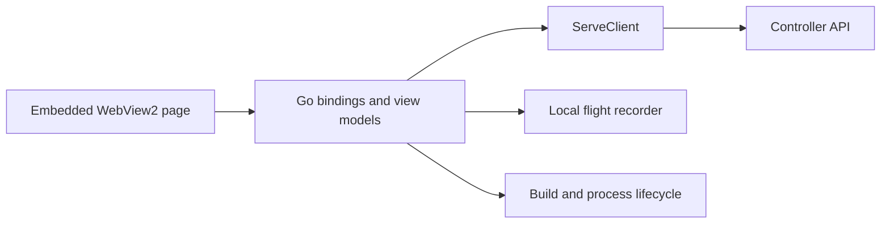

# Launcher

[Architecture](overview.md) · [Player controls](../../players/controls.md)

The Windows launcher is built from [go/cmd/launcher](../../../go/cmd/launcher).
It embeds a WebView2 page without a web server or frontend build. Go owns view
models and API calls; the page renders them through bound functions.

## Data flow

The page uses `SetHtml` and has an opaque origin. `ServeClient` makes HTTP
requests from Go, keeping the controller's origin checks intact. Each feed
retains its last good reading and marks failures stale. A 404 means the route
is not served, as in Observe mode.

Poll cadences live in the client. The page polls only its visible tab and skips
a tick while a request is in flight.

## Views

| Tab | Source and purpose |
| --- | --- |
| Launch | Launcher process/build state, saved games, settings and colony generation |
| Now | `/api/state`, `/api/spectator/now` and `/api/routines`, composed into Doing, Pursuing, Concerns and Waiting |
| Acceptance | Registered case list and one visible native run |
| Problems | Local flight recorder, grouped and filtered |
| Log | Current run's warnings, errors and selected informational events; build/start diagnostics |

[now.go](../../../go/cmd/launcher/now.go) builds the report; the page does not
rank Concerns or infer planner state. Spectator/routine reads use retained
review data and issue no native calls.

Problems refreshes asynchronously and retains its completed feed even after
the controller exits. [logview](../../../go/internal/logview) collapses repeated
events for Log. Telemetry remains local; it is not served through HTTP.

## Controls

Play passes `serve --resume`, enabling Auto at startup and after loads.
The launcher has no Resume/Pause/Acknowledge buttons. Manual control uses
RimWorld's pause. Default execution uses Ultrafast pacing;
`--follow-player-speed` permits following the native speed selection.

Stop ends the controller; Close game closes this checkout's private game.
Settings are saved in `.rimgovernor/launcher.json`. Journal selection and save
behavior are described in [save and resume](../../players/save-and-resume.md).

## Acceptance tab

The launcher queries `acceptance list` once per process; restart after adding
cases. Runs use its private root, a fresh output directory and
`-headless=false -no-series`. **From scratch** adds `-fresh`; otherwise a
failed run can resume from its checkpoint.

The tab refuses while the controller or game is running. A run installs the
required fixture build; after the game closes, normal launch restores the
production build. Stop ends the runner's process tree; Close game ends the
game it left open. See the [acceptance guide](../testing/acceptance-guide.md).

## New colony panel

[newcolony.go](../../../go/cmd/launcher/newcolony.go) supplies native option
lists, ranges, DLC requirements and progress. The page renders the options
without inventing or filtering them. Its elapsed timer advances between polls;
failed polls mark retained values stale.

Go derives a unique save name from scenario, biome and seed. On completion the
page selects it in Saved game. Generation and cancellation behavior are in
[launch](../../players/launch.md#new-colony).

## Diagnostics

The recorder defaults to `<profile>/flight/flight.jsonl`, a 16 × 32 MiB ring.
Observe mode places its recorder beside the state path; `--flight-recorder`
overrides the location. Launcher and acceptance readers use
`bridge.TimelineReader`; see [flight rows](../contracts/flight-rows.md).
