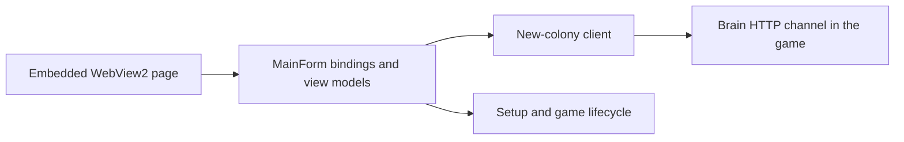

# Launcher

[Architecture](overview.md) · [Player controls](../../players/controls.md)

The Windows launcher is the C# project [tools/launcher](../../../tools/launcher):
a WinForms window hosting WebView2, published as one file,
`RimGovernorLauncher.exe`, by `RimGovernor.cmd`. It is its own project outside
the brain solution and references the acceptance harness
(`brain/src/RimGovernor.Brain.Acceptance`) for setup and case runs. 

A double-click publishes only when the launcher is stale: `RimGovernor.cmd`
brings the tool host up to date, then runs `rg launcher-stale`, which compares
the sources (`tools/launcher` including `ui/index.html`, its project-reference
closure and the shared `brain/` build files) with the stamp
`.rimgovernor/launcher-build/current`, written after a successful publish and
copy. The check is `SelfBuild`, the same mtime logic the tool host uses on
itself.

It embeds one WebView2 page (`ui/index.html`, an embedded resource) without a
web server or frontend build. C# owns the view models and the game's HTTP calls;
the page renders them through bound functions (`MainForm` defines each as a
global function that posts a message and returns a promise, so an error
surfaces in the page as `e.message`). The Evergreen WebView2 runtime is
assumed; when it is missing the launcher says so and exits.

## Data flow

```mermaid
flowchart LR
    UI[Embedded WebView2 page] --> Bind[MainForm bindings and view models]
    Bind --> Colony[New-colony client]
    Colony --> API[Brain HTTP channel in the game]
    Bind --> Process[Setup and game lifecycle]
```

The page is loaded with `NavigateToString` and has an opaque origin, so the
new-colony client makes its HTTP requests from C#. The game's address comes from
the `http-endpoint.json` file the in-process brain writes (address, pid, run id);
the launcher trusts it only when its pid is the game it started and
`/api/health` answers. The Observe tab reads the same channel.

The page polls only its visible tab and skips a tick while a request is in flight.

## Views

| Tab | Source and purpose |
| --- | --- |
| Launch | Game files and mod state, saved games, settings and colony generation; the Details log of build and start diagnostics |
| Observe | View of the running brain (Now, Concerns, Problems and Log) with the bot's Resume and Pause buttons |
| Acceptance | Registered case list and one visible native run |

## Observe tab

The tab polls `getObserve(since)` (`ObserveService` in [Observe.cs](../../../tools/launcher/Observe.cs)) every 1.5 s while it shows. The reply carries
`GET /api/state`, `/api/routines`, `/api/player/colony` and `/api/player/control` as the game answered them (null when a
route does not answer; the page shows unknown, never a guess), plus the rows the game's log ring
(`otlp/logs.jsonl`, read with `LogTail`) gained since `since`. The first read of a ring starts at its end,
so history from an earlier run is not shown; the launcher keeps the newest 3000 rows and counts
WARN and ERROR rows since it began watching. Views: Now (emergencies, colony census, resource
runways, latest rounds review, newest `clock_step`, `clock_stop`, `clock_hold`, `clock_resume` and `authority`
rows), Concerns (every concern's method, blocker and next review, from `/api/routines`), Problems
(WARN and ERROR rows collapsed by kind, component, verdict, reason and target) and Log (filter by
level, kind regex and text). The bar above the views shows Bot on or Bot off (`state.enabled` from
`GET /api/player/control`) with Resume and Pause buttons (`setBot` in `ObserveService`), which post to the
[player control routes](../contracts/player-api.md#control-api-and-launcher) for the world the brain observes; a
refusal's text appears under the bar. They are the only writes the tab makes; `openLink` accepts only the player guide.

## Controls

Play starts RimWorld from the private game copy with `-rimgovernor-inproc` and
the settings' extra arguments, then waits (up to five minutes) for the endpoint
file and a healthy channel. When the settings name a save to load, it is loaded
once the channel answers: `SaveLoader` posts `POST /api/lifecycle/load` every
250 ms until the brain registers the route (404 before that), then polls the
request every 250 ms until the map is loaded. There is no separate brain process: the brain runs inside
the game, so Stop and Close game both end RimWorld.

A running game is reused (Play adopting one, New colony) only when it can serve
the start as a fresh launch would: the mod list and package match the launch
snapshots `GameSessions.PrepareFreshLaunch` records (`HeadlessProfile.LaunchedMismatch`,
the check acceptance's kept game uses), no mod update is pending, and the
launcher itself started that process with the command line and host
environment the current settings give. That last record is in memory, so a
game started before the launcher (re)opened is restarted. Anything else closes
the game and starts it afresh; the log names the reason.

Settings are saved in `.rimgovernor/launcher.json`. Extra arguments and the save
to load act in the launcher. Observe, continue and layout overlay reach the
in-process host as the `RIMGOVERNOR_OBSERVE`, `RIMGOVERNOR_CONTINUE_STATE` and
`RIMGOVERNOR_LAYOUT_OVERLAY` environment variables of the game
([brain host](brain-host.md#hosting-in-the-mod-3115)); Observe also blocks colony
generation in the launcher.
Journal selection and save behavior are described in
[save and resume](../../players/save-and-resume.md).

The window's bounds are kept in `.rimgovernor/launcher-window.json`, and the
game window's in `.rimgovernor/game-window.json` (RimWorld does not remember
its own).

## Acceptance tab

The case list is the registry linked into the launcher
(`RimGovernor.Brain.Acceptance.Cases`). Runs go through the acceptance command
in this process: its private root, a fresh output directory and
`-headless=false -no-series`. **From scratch** adds `-fresh`; otherwise a
failed run can resume from its checkpoint.

The tab refuses while the game is running. A run installs the required fixture
build; after the game closes, the poll restores the production build. Stop
cancels the run; Close game ends the game it left open. See the
[acceptance guide](../testing/acceptance-guide.md).

## New colony panel

[NewColony.cs](../../../tools/launcher/NewColony.cs) supplies the option lists,
ranges, DLC requirements and the Rhadamant preset; the page renders them without
inventing or filtering them. The runner
([NewColonyRunner.cs](../../../tools/launcher/NewColonyRunner.cs)) returns a
reusable running game to the main menu (`POST /api/lifecycle/menu`, polled, a
busy game's 503 asked again for up to 90 s), or closes the game and starts it
afresh, then posts `POST /api/lifecycle/new` and polls
`GET /api/lifecycle/new?requestId=` every 250 ms. Its elapsed timer advances between polls;
failed polls mark retained values stale. The form is validated by the same
`BridgeFunctions.ValidateNewColonyRequest` the game's route uses, and the spec
embeds the scenario parts, so settings, page and wire share one shape. The
part rows' choice lists live in the same file.

The launcher derives a unique save name from scenario, biome and seed. On
completion the page selects it in Saved game. Generation and cancellation
behavior are in [launch](../../players/launch.md#new-colony).
