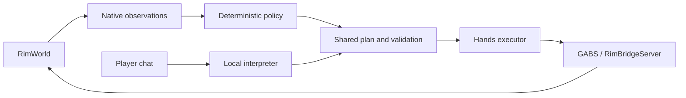

# Architecture

[Developer guide](../README.md) · [Source map](../source-map.md)

Routine colony control is deterministic. A local model interprets explicit player
chat and offers advice. Both submit work to the same durable plan and Hands executor;
RimWorld determines legality and simulates the result.

| Component | Owns |
| --- | --- |
| Python controller | Observations, goals, resource accounting, execution, recovery and local API. |
| React dashboard | Player direction and views of controller state; drafts and last good data survive refreshes. |
| GABS / RimBridgeServer | Tool discovery and calls into the game. |
| Native colony bridge | Colony-specific observations, guarded operations and saved identity. |
| RimWorld | Simulation, legal placement and ordinary pawn work. |

The Go controller and unified native mod are gated migrations; see the
[G01](https://github.com/davidarcher/rimgovernor/issues?q=is%3Aissue+is%3Aopen+label%3A%22area%3AG01%22)
and [N01](https://github.com/davidarcher/rimgovernor/issues?q=is%3Aissue+is%3Aopen+label%3A%22area%3AN01%22)
issues before changing runtime ownership.

## Execution rules

- Validate resources, geometry and current context before issuing work.
- Record intent before writes; observe uncertain outcomes before retrying.
- Verify completed buildings, produced goods or other native postconditions.
  Accepted orders alone do not complete goals.
- Preserve unknown observations. Forecasts select work; native facts establish results.
- Player direction, Manual and colony/map/load changes invalidate pending work.
- Keep game saves and controller checkpoints paired across recovery.

For implementation detail, follow the [component guides](../README.md#component-guides)
and [subsystem contracts](../contracts/README.md). Docker isolates processes and
inputs; gameplay validation still requires native outcome assertions.
