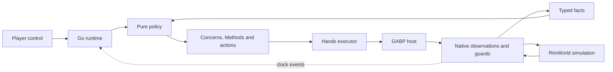
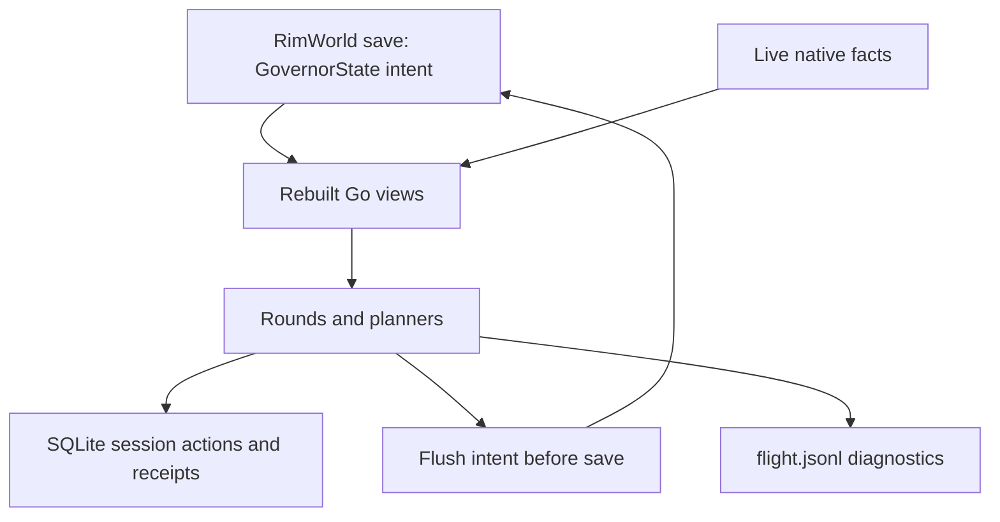

# Architecture

[Developer guide](../README.md) · [Source map](../source-map.md) ·
[Rules](rules.md)

RimGovernor is a deterministic control loop around RimWorld. Go chooses work,
native code validates and issues game operations, and RimWorld simulates their
effects. Routine play requires no model calls.

```mermaid
flowchart LR
    Player[Player control] --> Runtime[Go runtime]
    Game[RimWorld simulation] --> Native[Native observations and guards]
    Native --> Facts[Typed facts]
    Facts --> Policy[Pure policy]
    Policy --> Plan[Concerns, Methods and actions]
    Plan --> Hands[Hands executor]
    Hands --> Host[GABP host]
    Host --> Native
    Native --> Game
    Runtime --> Policy
    Native -. clock events .-> Runtime
```

## Ownership

| Component | Owns | Does not decide |
| --- | --- | --- |
| Policy | Findings, forecasts, method choices, tactics and demand | Transport, persistence or wall-clock scheduling |
| Runtime | Planner scheduling, authority, lifecycle and composition | RimWorld simulation |
| Store and Hands | Admission, action identity, write journal and reconciliation | Whether a Concern's colony outcome is satisfied |
| Native bridge | Typed observations, operation guards, clock supervision and leased rules | Colony strategy |
| GABP host | Tool discovery, request transport and main-thread dispatch | Colony policy |
| RimWorld | Legality, pathing, pawn jobs and physical outcomes | Governor intent |
| Launcher | Starts/stops sessions and presents observed state | Planner execution |

The intended order path is through Hands. Existing combat batches still call
the native boundary directly; unification is tracked in
[#2502](https://github.com/davidarcher/rimgovernor/issues/2502).
Do not use that exception as a pattern for new writers.

## The control cycle

1. Read a coherent native frame; retain unknowns explicitly.
2. Inspect Concerns and select due or invalidated planners.
3. Validate proposals against current authority, dependencies and claims.
4. Journal admitted actions before dispatch; retain receipts or uncertainty.
5. Observe native outcomes and update Concern progress.

Routine planning can run while the supervised game window is advancing.
Native hazard stops and expiring leases protect the game independently of
planner completion. Detection time, scheduler wake time and time to a useful
protective effect are distinct measurements.

## State and evidence

```mermaid
flowchart TD
    Save[RimWorld save: GovernorState intent] --> Views[Rebuilt Go views]
    World[Live native facts] --> Views
    Views --> Review[Rounds and planners]
    Review --> Journal[SQLite session actions and receipts]
    Review --> Flush[Flush intent before save]
    Flush --> Save
    Review --> Flight[flight.jsonl diagnostics]
```

The [persistence table](../contracts/persistence-contracts.md) defines each
fact's home. Loading a save restores that timeline's intent and invalidates old
execution context. SQLite is the session journal, not a second colony save.

An accepted construction order may complete its action contract while the
Concern still waits for a finished building. Unknown facts never prove recovery.

## Read next

- [Control loop](control-loop.md): Rounds, scheduling, native events and Manual.
- [Plans and Hands](plans-and-hands.md): admission, dispatch and completion.
- [Sessions and recovery](sessions-and-recovery.md): saves, authority and uncertain writes.
- [Space and resources](space-and-resources.md), [supply](supply-model.md),
  [facilities](facilities.md) and [storage](storage.md): physical colony planning.
- [Hazard bounds](hazard-detection-bounds.md) and [combat](combat-game-ai.md):
  native timing and tactical responsibilities.
- [Expert-play roadmap](expert-play-assessment.md): proposed guarantees and their
  evaluation criteria.
