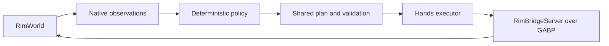

# Architecture

[Developer guide](../README.md) · [Source map](../source-map.md)

Routine colony control is deterministic. RimWorld determines legality and simulates the result.

```mermaid
flowchart LR
    Game[RimWorld] --> Facts[Native observations]
    Facts --> Policy[Deterministic policy]
    Policy --> Plan[Shared plan and validation]
    Plan --> Hands[Hands executor]
    Hands --> Bridge[RimBridgeServer over GABP]
    Bridge --> Game
```

| Component | Owns |
| --- | --- |
| Go controller | Observations, goals, resource accounting, execution, recovery and local API. |
| Launcher | The player UI: starts and stops the controller and game, shows controller state and offers Resume, Pause and Acknowledge; last good data survives refreshes. |
| RimBridgeServer (GABP) | Game-side tool server; the controller launches the game and calls its tools over GABP directly. |
| Native colony bridge | Colony-specific observations, guarded operations and saved identity. |
| RimWorld | Simulation, legal placement and ordinary pawn work. |

## Execution rules

- Validate resources, geometry and current context before issuing work.
- Record intent before writes; observe uncertain outcomes before retrying.
- Verify completed buildings, produced goods or other native postconditions.
  Accepted orders alone do not complete goals.
- Preserve unknown observations. Forecasts select work; native facts establish results.
- Colony/map/load changes and tick rewinds invalidate pending work. Manual
  (pause, letter pause, restart) only suspends routine goals and their open
  work until control resumes in the same world.
- Each fact has one home ([persistence contracts](../contracts/persistence-contracts.md)); goals live in the save.

For implementation detail, follow the [component guides](../README.md#component-guides)
and [subsystem contracts](../contracts/README.md). Gameplay validation requires native outcome assertions.
