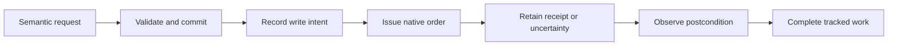

# Plans and Hands

[Architecture](overview.md) · [Go player API](../contracts/go-player-api.md)

Player requests and routine automation share admission checks, resource accounting
and completion tracking. The plan owns goals; Hands deterministically executes
accepted work. Advisers cannot commit game orders.

## Keep intent and progress separate

The specification records what is wanted. Progress records attempted writes,
created native objects, uncertainty and completion. Stable step identities connect
them across reviews and restarts. Partially ordered construction retains known
blueprints and sends only the remaining admissible work.

Admission checks geometry, native placement, resources and existing commitments.
Acknowledging a request establishes acceptance; completion requires the
[action's native postcondition](../contracts/action-contracts.md).

## Recover and cancel precisely

A refusal before writing can be reconsidered when conditions change. A lost reply
after dispatch may conceal an accepted order: retain intent and inspect the game
before retrying. Recovery preserves action identity and requires fresh context.
See [sessions and recovery](sessions-and-recovery.md).

Cancelling a goal stops pursuit while retaining issued game orders. Removing
construction is a separate explicit request against exact pending objects;
completed buildings and neighboring or replacement objects remain protected.

Manual stops routine automation but permits current explicit player work through
Hands while paused. It does not resume simulation. Direction and colony/map/load
changes invalidate work prepared under the previous context.

Implementation: [go/internal/domain](../../../go/internal/domain) (plans/goals),
[go/internal/store](../../../go/internal/store) and
[go/internal/executor](../../../go/internal/executor).
