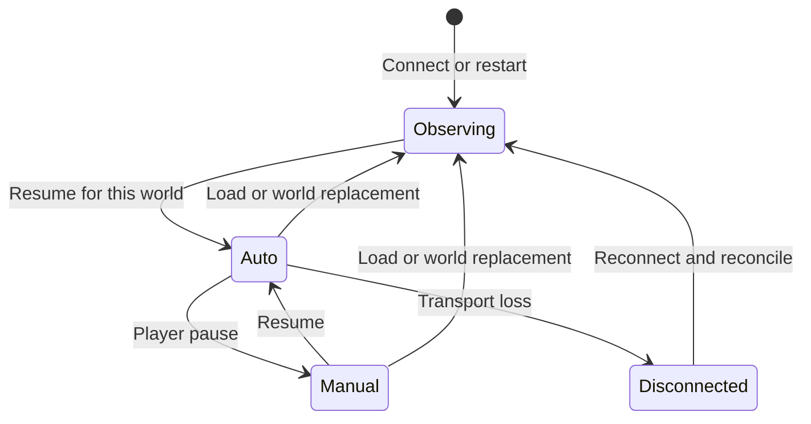

# Sessions and recovery

[Architecture](overview.md) · [Persistence contract](../contracts/persistence-contracts.md)

Colony and map identity scope intent; the load token identifies the current
world instance. Authority also checks native tick, order generation and whether
control is paused. Observation refreshes do not grant authority.

## Save, load and restart

Ordinary RimWorld saves carry Go intent in opaque `GovernorState` blobs.
Before a save, native's `pre_save` handshake lets Go flush the blobs in one
batch. A save made while Go is disconnected retains the last flushed intent.
The SQLite journal is not a paired player save.

A load creates a new token. Go rebuilds views from the save before reviewing,
invalidates old bindings and cancels undispatched work; uncertain dispatched work
retains its recovery requirement. Methods are planned against the loaded world.

`serve --resume` enables Auto at startup and after loads; the launcher passes
it. Bare serve waits for Resume. A profile lock permits only one controller
author. Restart can revoke stale native authority and grant a fresh lease.

## Game process and connection

The controller launches the configured game through `internal/gamehost`, passing
the GABP port/token/game ID and recording PID plus process start time in
`<config>/<id>/endpoint.json`. The detached game can outlive the controller;
a replacement controller can reattach to the endpoint.

GABP correlates concurrent requests by ID. Tool calls do not block the host's
reader thread; main-thread game operations remain scheduled by native code.
Clock-journal reads are unheld and follow advance announcements.

On transport loss, calls fail as disconnected while the supervisor reconnects
with bounded backoff. Native revokes authority when its lease lapses.
`--resume` can reacquire after a disconnect only while the recorded control
intent still requests running in that world; a player's Pause stands.

## Uncertain writes and read retries

A lost reply may conceal an accepted order. Retain its action identity and
inspect the world before deciding what remains; never automatically replay an
ambiguous non-idempotent mutation. A new load or tick rewind invalidates the old
attempt's context.

Read/preview retries are bounded. Transport recovery is not mutation retry.
Prepared but undispatched work can be prepared under fresh authority because
it has no outstanding native write.

## Cleanup

Each worker owns its controller, private root and game process. Stop by root or
verified PID. Stop games using a private copy before replacing its DLLs; never
modify Steam or a peer's copy. See the [runbook](../agent-runbook.md).

Player instructions: [save and resume](../../players/save-and-resume.md).
