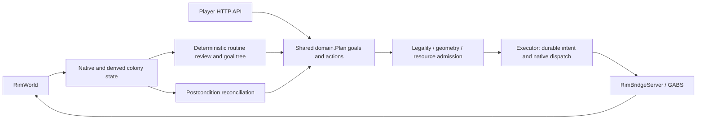

# Source map

[Documentation](../README.md)

The runtime is Go (`go/`), the dashboard is React (`dashboard/`), and native
operations pass through GABS/RimBridgeServer and the colony bridge companion
(`integrations/rimgovernor-native`).

| Piece | Responsibility and source |
| --- | --- |
| Entry and lifecycle | [launch.cmd](../../launch.cmd)/[launch-go.ps1](../../launch-go.ps1) build/reuse the Go binary and dashboard assets and start it; [go/cmd/rimgovernor](../../go/cmd/rimgovernor) is the `serve`/`version`/`help` entry point. |
| Domain | [go/internal/domain](../../go/internal/domain) defines the core types — plans, actions, goals — shared across policy, store and executor. |
| Policy | [go/internal/policy](../../go/internal/policy) evaluates routine survival facts, deficits and admission rules (food, power, temperature, mood, defense, disaster, work, and more — see [go/README.md](../../go/README.md)). |
| Building runtime | [go/internal/buildingruntime](../../go/internal/buildingruntime) composes the routine reviewer, planners and player-command handlers into a running colony loop. |
| Store | [go/internal/store](../../go/internal/store) persists plans, goals, methods, receipts and player submissions in SQLite, with CAS-token admission. |
| Executor | [go/internal/executor](../../go/internal/executor) dispatches admitted actions to the native bridge and reconciles receipts/outcomes. |
| Native boundary | [go/internal/bridge](../../go/internal/bridge) talks to GABS over MCP; [go/internal/observation](../../go/internal/observation) decodes native reads into typed facts. |
| Interpreter | [go/internal/interpreter](../../go/internal/interpreter) decodes chat-shaped commands into typed proposals; not yet wired into `serve`'s HTTP server (see [issue #46](https://github.com/davidarcher/rimgovernor/issues/46)). |
| HTTP API | [go/internal/httpapi](../../go/internal/httpapi) serves dashboard state, player command endpoints, checkpoints, media and diagnostics, and the built dashboard assets. |
| Native acceptance | [go/internal/nativeaccept](../../go/internal/nativeaccept) holds the registered acceptance cases (`cases/<area>`) and their one runner (`cmd/acceptance`) verified against a real headless RimWorld instance; coverage gaps are tracked in [issue #38](https://github.com/davidarcher/rimgovernor/issues/38). |
| Game integration | [integrations/rimgovernor-native/src/Bridge](../../integrations/rimgovernor-native/src/Bridge) supplies colony/status, pawn, item, building, room, zone, cell, research and world reads; construction, installation, settings, bills, orders, trade and dialog actions; clock supervision and rendering demand. The separate identity assembly persists colony identity in saves. RimBridgeServer supplies general game/UI tools. |
| Dashboard | [dashboard/src](../../dashboard/src) is the React/TypeScript UI; it detects the Go backend (`GET /api/health`) and renders structured observation/player controls. |

## Related reading

Start with [the system overview](architecture/overview.md) for the relationships
between these components, and [go/README.md](../../go/README.md) for the
current capability boundary and testing pyramid.
