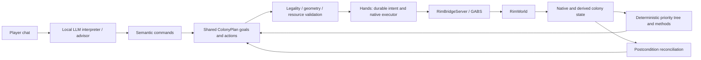

# Source map

[Documentation](../README.md)

The runtime is Python, the dashboard is React, and native operations pass through
GABS/RimBridgeServer and the colony bridge companion.

| Piece | Responsibility and source |
| --- | --- |
| Entry and lifecycle | [launch.ps1](../../launch.ps1) prepares/reuses the isolated game and controller; [controller/rimgovernor/__main__.py](../../controller/rimgovernor/__main__.py) starts FastAPI/Uvicorn on loopback port 8787. [headless.py](../../controller/rimgovernor/headless.py) prepares separate test profiles. |
| Runtime | [bridge_runtime.py](../../controller/rimgovernor/bridge_runtime.py) coordinates observation, reviews, execution, player direction, identity, clock events and rendering. Async guards prevent stale work after direction, plan or load changes. |
| Native boundary | [bridge.py](../../controller/rimgovernor/bridge.py) uses the MCP SDK to launch GABS and discover/call installed tools. [bridge_game.py](../../controller/rimgovernor/bridge_game.py) restricts gameplay capabilities; [native_contracts.py](../../controller/rimgovernor/native_contracts.py) validates native arguments and receipts. |
| Game integration | [integrations/colony-bridge/src](../../integrations/colony-bridge/src) supplies colony/status, pawn, item, building, room, zone, cell, research and world reads; construction, installation, settings, bills, orders, trade and dialog actions; clock supervision and rendering demand. The separate identity assembly persists colony identity in saves. RimBridgeServer supplies general game/UI tools. |
| Observation | [bridge_observation.py](../../controller/rimgovernor/bridge_observation.py) preserves raw responses and projects the generated [bridge_models.py](../../controller/rimgovernor/bridge_models.py) DTO. [data/bridge_observation.schema.json](../../controller/rimgovernor/data/bridge_observation.schema.json) is its source; [scripts/generate_bridge_observation.py](../../scripts/generate_bridge_observation.py) checks generation drift. |
| Control | [colony_controller.py](../../controller/rimgovernor/colony_controller.py) evaluates the priority tree in [colony_policy.py](../../controller/rimgovernor/colony_policy.py) and decomposes goals with [colony_skills.py](../../controller/rimgovernor/colony_skills.py). [player_commands.py](../../controller/rimgovernor/player_commands.py) validates semantic chat requests; [planner.py](../../controller/rimgovernor/planner.py) interprets only new human messages. [colony_plan.py](../../controller/rimgovernor/colony_plan.py) separates goals/specifications from execution progress. [resource_accounting.py](../../controller/rimgovernor/resource_accounting.py) arbitrates both paths. |
| Execution | [hands.py](../../controller/rimgovernor/hands.py) compiles semantic steps, validates geometry, records intent and advances native orders. [construction_grounding.py](../../controller/rimgovernor/construction_grounding.py) and [construction_preflight.py](../../controller/rimgovernor/construction_preflight.py) ground definitions and preview placement. [projects.py](../../controller/rimgovernor/projects.py), [medical_outcome.py](../../controller/rimgovernor/medical_outcome.py) and [trading.py](../../controller/rimgovernor/trading.py) reconcile specific outcomes. |
| Inference and advice | [model.py](../../controller/rimgovernor/model.py), [request_budget.py](../../controller/rimgovernor/request_budget.py) and [model_router.py](../../controller/rimgovernor/model_router.py) handle local streaming requests, structured-response recovery, context budgets and optional roles. [consultation.py](../../controller/rimgovernor/consultation.py), [scout.py](../../controller/rimgovernor/scout.py) and [visual_review.py](../../controller/rimgovernor/visual_review.py) supply bounded advice. |
| Knowledge and persistence | [knowledge.py](../../controller/rimgovernor/knowledge.py) retrieves local strategy cards; [wiki.py](../../controller/rimgovernor/wiki.py) retrieves reference material. [memory.py](../../controller/rimgovernor/memory.py) stores advisory colony notes. [review_evidence.py](../../controller/rimgovernor/review_evidence.py) retains exact review-local results in memory. [store.py](../../controller/rimgovernor/store.py) persists state, events and retired action/method evidence in SQLite; its bounded compressed decision-snapshot helpers currently have no runtime callers. |
| Dashboard and diagnostics | [bridge_server.py](../../controller/rimgovernor/bridge_server.py) serves the Vite-built dashboard and state, chat, control, project, notebook, camera and diagnostic endpoints. [dashboard/src/features/manager](../../dashboard/src/features/manager) renders colony/people, plans, activity and notes. [tool_diagnostics.py](../../controller/rimgovernor/tool_diagnostics.py) records strategy/native call outcomes. |

Unqualified Python module names in the table are under
[controller/rimgovernor/](../../controller/rimgovernor).

## Related reading

Docker native staging uses [container_worker.py](../../controller/rimgovernor/container_worker.py)
for private copies and [container_input_cache.py](../../controller/rimgovernor/container_input_cache.py)
for verified, immutable input snapshots. The host
[cache helper](../../scripts/container_input_cache.py) hashes sources and prepares local
Docker volumes; [native acceptance](../../scripts/container_native_acceptance.py) mounts
them read-only. See [input caching](testing/docker-inputs.md#reuse-docker-input-snapshots).

Start with [the system overview](architecture/overview.md) for the relationships
between these components.
