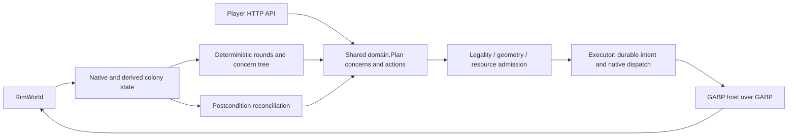

# Source map

[Documentation](../README.md)

The runtime and the launcher UI are Go (`go/`), and native
operations pass over GABP to the GABP host and the colony bridge companion
(`integrations/rimgovernor-native`).

```mermaid
flowchart LR
    Game[RimWorld] --> Facts[Native and derived colony state]
    Facts --> Policy[Deterministic rounds and concern tree]
    Player[Player HTTP API] --> Plan[Shared domain.Plan concerns and actions]
    Policy --> Plan
    Plan --> Validate[Legality / geometry / resource admission]
    Validate --> Executor[Executor: durable intent and native dispatch]
    Executor --> Bridge[GABP host over GABP]
    Bridge --> Game
    Facts --> Outcomes[Postcondition reconciliation]
    Outcomes --> Plan
```

| Piece | Responsibility and source |
| --- | --- |
| Entry and lifecycle | [go/cmd/launcher](../../go/cmd/launcher) (RimGovernorLauncher.exe) rebuilds the controller, native mod and game layout when stale and starts/stops `serve`; [go/cmd/rimgovernor](../../go/cmd/rimgovernor) is the `serve`/`version`/`help` entry point. |
| Domain | [go/internal/domain](../../go/internal/domain) defines the core types — plans, actions, concerns — shared across policy, store and executor. |
| Policy | [go/internal/policy](../../go/internal/policy) evaluates routine survival facts, deficits and admission rules (food, power, temperature, mood, defense, disaster, work, and more — see [go/README.md](../../go/README.md)). |
| Supply simulator | [go/internal/supplysim](../../go/internal/supplysim) is a pure, seeded day-by-day stock-flow simulator (goods, consumers, a labor budget, sources with lead, finite or regenerating stock and calendar windows, shocks) plus resource dynamics (tree regrowth, recipes, buried veins, powered deep drills, threat-gated windfalls, caravans, latched floors, build shortfalls, runway forecasts; `resources.go` names each constant's policy source) that returns a per-day `Report` with runway and first-starved day. It models flows, not pawns, imports only `domain`, and drives a `Planner` through adapters that live in test packages (epic #2140). The food adapter and matrix are `supplysim_food_test.go` in [buildingruntime](../../go/internal/buildingruntime) (the real `reviewFoodPlan`; baseline failures in `testdata/food-matrix-baseline.json`), with calibration tests beside it. |
| Building runtime | [go/internal/buildingruntime](../../go/internal/buildingruntime) composes the rounder, planners and player-command handlers into a running colony loop. |
| Store | [go/internal/store](../../go/internal/store) persists plans, concerns, methods, receipts and player submissions in SQLite, with CAS-token admission. |
| Executor | [go/internal/executor](../../go/internal/executor) dispatches admitted actions to the native bridge and reconciles receipts/outcomes. |
| Native boundary | [go/internal/bridge](../../go/internal/bridge) launches the game (via go/internal/gamehost) and talks GABP to the GABP host directly; [go/internal/observation](../../go/internal/observation) decodes native reads into typed facts. |
| HTTP API | [go/internal/httpapi](../../go/internal/httpapi) serves observed state, the player control endpoints, checkpoints, media and diagnostics. |
| Native acceptance | [go/internal/nativeaccept](../../go/internal/nativeaccept) holds the registered acceptance cases (`cases/<area>`) and their one runner (`cmd/acceptance`) verified against a real headless RimWorld instance; coverage gaps are tracked in [issue #38](https://github.com/davidarcher/rimgovernor/issues/38). |
| Game integration | [integrations/rimgovernor-native/src/Bridge](../../integrations/rimgovernor-native/src/Bridge) supplies colony/status, pawn, item, building, room, zone, cell, research and world reads; construction, installation, settings, bills, orders, trade and dialog actions; clock supervision and rendering demand. The separate identity assembly persists colony identity in saves. The GABP host supplies only the load, save, time-speed, tick-stepping and log/status tools Go calls. |
| GABP host | [integrations/rimgovernor-host/src](../../integrations/rimgovernor-host/src) is the vendored fork of pardeike/RimBridgeServer and pardeike/Lib.GAB, renamed `RimGovernor.Host*`, built into the one mod and pruned (#2056) to what Go and the native mod call: 58 C# files, 380 KB, from 111 files, 1.46 MB; 7 built-in tools, from 125. Provenance, vendored commit SHAs, licences and the prune list: [Notices/host](../../integrations/rimgovernor-native/Notices/host/PROVENANCE.md). Kept: `Gab` (the GABP server, tool registry, transport, event and attention managers), `Core` (operation and log journals, capability registry, attention aggregation, save-mod compatibility, readiness and wait helpers, companion discovery), `Contracts`, `Extensions.Abstractions`, `Sdk` (`[Tool]` attributes and `IRimBridgeContext` with `Arguments` and `MainThread`, the only SDK surface the Bridge tools use) and in `Host` the mod entry and Harmony `Root.Update` pump, `MainThreadDispatcher`, the async scheduler, tick stepper, startup, `RimBridgeEventRelay` and `RimBridgeAttentionPublisher`, log capture, extension discovery (it keeps the by-name `AssemblyResolve`: the Bridge bundle is loaded with `Assembly.LoadFile` and still needs the host SDK and Google.Protobuf bound by simple name), `AnnotatedExtensionCapabilityProvider` (how the Bridge's `[Tool]` classes become tools; the contract probes bind through it and `LegacyToolExecution`) and the `Diagnostics` and `Lifecycle` capability modules. The seven tools are `rimgovernor/set_time_speed`, `play_for`, `step_game_ticks`, `save_game`, `load_game_ready` and `rimgovernor/list_logs`, `get_bridge_status`: the only host tools any Go caller, acceptance case or script names. Deleted: the UI workbench, virtual pointer, map click injector, input, architect, context-menu, view/screenshot, DPA, selection, notification, mod-settings and debug-action modules; Lua and script scripting with MoonSharp; the SDK tool client, game clock and evidence helpers and the ambient `RimBridge` accessor (no Bridge tool used them); the camera zoom-extension (the Bridge camera read now reports it as always off, since nothing can enable it); the optional Harmony patch scan; and the operation, capability and wait tools. |
| Launcher UI | [go/cmd/launcher](../../go/cmd/launcher) is also the player UI: a WebView2 page ([ui/index.html](../../go/cmd/launcher/ui/index.html)) with Launch, Now and Problems tabs over Go-side view models and a serve client ([launcher doc](architecture/launcher.md)). |

## Related reading

Start with [the system overview](architecture/overview.md) for the relationships
between these components, and [go/README.md](../../go/README.md) for the
current capability boundary and testing pyramid.
