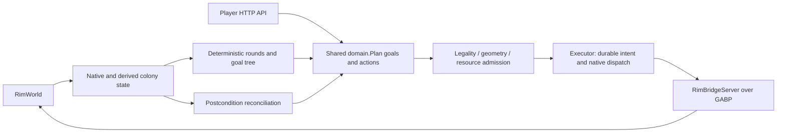

# Source map

[Documentation](../README.md)

The runtime and the launcher UI are Go (`go/`), and native
operations pass over GABP to RimBridgeServer and the colony bridge companion
(`integrations/rimgovernor-native`).

```mermaid
flowchart LR
    Game[RimWorld] --> Facts[Native and derived colony state]
    Facts --> Policy[Deterministic rounds and goal tree]
    Player[Player HTTP API] --> Plan[Shared domain.Plan goals and actions]
    Policy --> Plan
    Plan --> Validate[Legality / geometry / resource admission]
    Validate --> Executor[Executor: durable intent and native dispatch]
    Executor --> Bridge[RimBridgeServer over GABP]
    Bridge --> Game
    Facts --> Outcomes[Postcondition reconciliation]
    Outcomes --> Plan
```

| Piece | Responsibility and source |
| --- | --- |
| Entry and lifecycle | [go/cmd/launcher](../../go/cmd/launcher) (RimGovernorLauncher.exe) rebuilds the controller, native mod and game layout when stale and starts/stops `serve`; [go/cmd/rimgovernor](../../go/cmd/rimgovernor) is the `serve`/`version`/`help` entry point. |
| Domain | [go/internal/domain](../../go/internal/domain) defines the core types — plans, actions, goals — shared across policy, store and executor. |
| Policy | [go/internal/policy](../../go/internal/policy) evaluates routine survival facts, deficits and admission rules (food, power, temperature, mood, defense, disaster, work, and more — see [go/README.md](../../go/README.md)). |
| Building runtime | [go/internal/buildingruntime](../../go/internal/buildingruntime) composes the rounder, planners and player-command handlers into a running colony loop. |
| Store | [go/internal/store](../../go/internal/store) persists plans, goals, methods, receipts and player submissions in SQLite, with CAS-token admission. |
| Executor | [go/internal/executor](../../go/internal/executor) dispatches admitted actions to the native bridge and reconciles receipts/outcomes. |
| Native boundary | [go/internal/bridge](../../go/internal/bridge) launches the game (via go/internal/gamehost) and talks GABP to RimBridgeServer directly; [go/internal/observation](../../go/internal/observation) decodes native reads into typed facts. |
| HTTP API | [go/internal/httpapi](../../go/internal/httpapi) serves observed state, the player control endpoints, checkpoints, media and diagnostics. |
| Native acceptance | [go/internal/nativeaccept](../../go/internal/nativeaccept) holds the registered acceptance cases (`cases/<area>`) and their one runner (`cmd/acceptance`) verified against a real headless RimWorld instance; coverage gaps are tracked in [issue #38](https://github.com/davidarcher/rimgovernor/issues/38). |
| Game integration | [integrations/rimgovernor-native/src/Bridge](../../integrations/rimgovernor-native/src/Bridge) supplies colony/status, pawn, item, building, room, zone, cell, research and world reads; construction, installation, settings, bills, orders, trade and dialog actions; clock supervision and rendering demand. The separate identity assembly persists colony identity in saves. RimBridgeServer supplies general game/UI tools. |
| Launcher UI | [go/cmd/launcher](../../go/cmd/launcher) is also the player UI: a WebView2 page ([ui/index.html](../../go/cmd/launcher/ui/index.html)) with Launch, Now and Problems tabs over Go-side view models and a serve client ([launcher doc](architecture/launcher.md)). |

## Related reading

Start with [the system overview](architecture/overview.md) for the relationships
between these components, and [go/README.md](../../go/README.md) for the
current capability boundary and testing pyramid.
