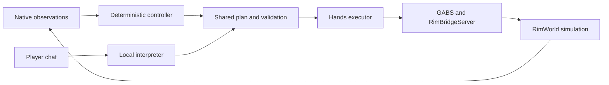

# How RimBot fits together

[Documentation](../README.md) · Explanation

RimBot has two ways to decide what to do. The deterministic controller handles routine
colony needs. A local language model interprets a player's explicit chat request and can
offer advice. Both paths submit work to one shared plan. RimWorld decides whether an
order is legal and whether pawns can actually carry it out.

That division is the central idea behind the internals. A model can ask for a room, but
it cannot make the room exist, reserve arbitrary map coordinates forever, or declare the
colony safe. Those conclusions require current native evidence.

## Follow one piece of work

Imagine the colony needs sleeping space. The controller observes the shortage, chooses a
shelter method, and proposes construction. The plan checks the proposal against
resources, geometry and existing work. Hands, the executor, turns accepted steps into
native orders. Pawns then build under normal game rules. Later observations determine
whether the shelter and sleeping places meet the goal.

An accepted blueprint is progress, but it is not a completed room. This distinction
explains much of the system: durable receipts prevent duplicate orders, fresh
observations verify outcomes, and holds give the controller a way to stop when the
evidence is insufficient.

## Where the pieces run

The Python controller owns plans, observations and the local web API. The React
dashboard presents those facts and accepts player direction. GABS is the bridge process
through which the controller discovers and calls RimBridgeServer tools. The native
colony bridge companion supplies colony-specific reads and guarded operations inside
RimWorld.

Docker can contain both Python and the Linux game. It changes how a test isolates its
processes and inputs; it does not remove the native observation path. Windows workers
instead use private profiles with shared installed binaries held fixed.

## Read deeper without reading everything

To understand routine behavior, continue with [the control loop](control-loop.md). To
follow a player request, read [plans and Hands](plans-and-hands.md). For module names
and source links, use the [source map](../reference/source-map.md).

The contract pages describe implemented rules. The [backlog](../BACKLOG.md) records
where ordinary gameplay acceptance or broader capability is still missing; the existence
of a method or a passing fixture test does not establish sustained colony survival.
