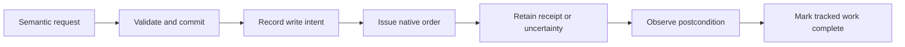

# Plans and Hands

[Documentation](../README.md) · [System overview](overview.md)

The shared plan is the connection between intent and execution. It lets player commands
and routine automation use the same legality checks, resource accounting and completion
tracking. Hands is the deterministic executor of that accepted work; it does not
independently decide the colony's goals.

## From a sentence to an accepted request

When a player sends a new chat message, the local interpreter produces semantic requests
such as building a room, selecting research or maintaining a food target. It works with
native labels and typed commands instead of an unrestricted native tool surface. Advice
can explain a situation, but advisers cannot commit orders.

Suppose the player requests a room. Admission checks the proposed geometry, native
placement rules, available materials and conflicts with other commitments. Only an
accepted request enters the shared execution path. A conversational acknowledgment
reports acceptance; it cannot promise that pawns finished building.

## Specification and progress have different lifetimes

The specification says what is wanted. Progress records what was attempted, which native
objects were created, what remains uncertain, and what is complete. Step identities link
these records across reviews and restarts.

That separation matters when only part of a room has been ordered. The next review must
retain the known blueprints and send only the remaining admissible work. Rebuilding the
plan from a description alone would lose the evidence needed to avoid duplicate orders
or accidental retargeting.

## An uncertain write is different from a refusal

A placement rejected before writing can sometimes recover when resources or placement
conditions change. A lost response after dispatch is more difficult: the game may have
accepted the order. Blindly retrying could create duplicate or incorrect work.

Hands therefore records intent before writing and observes uncertain outcomes. Recovery
keeps the existing action identity and requires fresh context. Exact conditions differ
by operation; [recovery contracts](../reference/recovery-contracts.md) define those
boundaries.

## Cancellation has two meanings

Cancelling a goal stops the controller from pursuing it and retains already-issued
native orders. Removing actual construction is a separate explicit player request that
captures exact pending targets. Completed buildings are preserved.

For the room example, cancelling its goal does not silently erase its blueprints. An
explicit construction cancellation can remove the tracked pending objects, with identity
checks preventing removal of neighboring or replacement objects. This distinction keeps
a change in controller intent from becoming an unintended destructive game action.

## Manual still permits explicit player work

Manual stops routine automation. A current explicit player request can still pass
through Hands while the game remains paused. This does not authorize unrelated
autonomous work or resume the simulation. Player direction and load changes invalidate
pending work that was prepared under an older context.

Read [player_commands.py](../../controller/rimgovernor/player_commands.py),
[colony_plan.py](../../controller/rimgovernor/colony_plan.py) and
[hands.py](../../controller/rimgovernor/hands.py) for the implementation. The [command
contracts](../reference/command-contracts.md) and [action completion
table](../reference/action-contracts.md) provide the exact rules.
